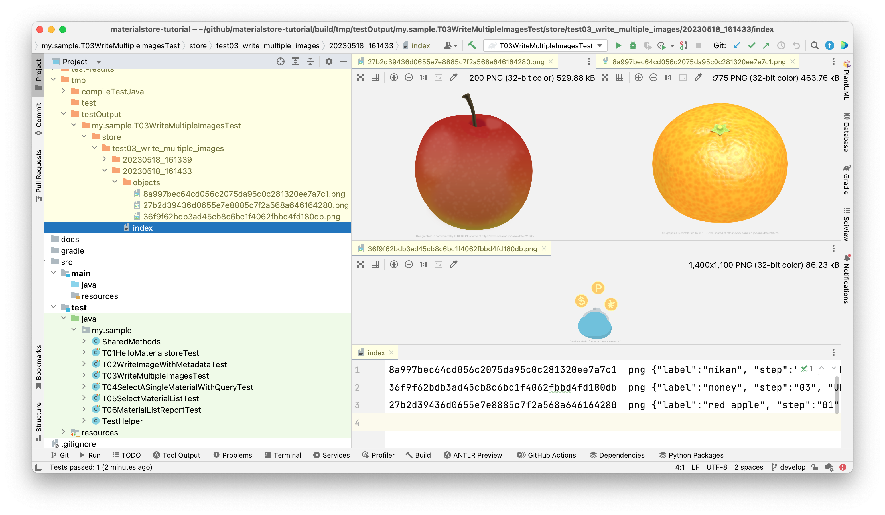

== 3rd example: writing multiple Materials

We are going to read the code of

- link:https://github.com/kazurayam/materialstore-tutorial/blob/master/src/test/java/my/sample/T03WriteMultipleImagesTest.java[my.sample.T03WriteMultipleImagesTest]

This class downloads 3 PNG image files from public URL and store them into the store on the local disk.

[source,text]
----
include::../../src/test/java/my/sample/T03WriteMultipleImagesTest.java[lines=18..40]
----

This code calls `SharedMethods.write3images(Store, JobName, JobTimestap)` method. It is implemented as this:

[source, java]
.SharedMethod.write3images
----
include::../../src/test/java/my/sample/SharedMethods.java[lines=46..80]
----

This code makes HTTP requests to the following URLs:

* http://kazurayam.github.io/materialstore-tutorial/images/tutorial/03_apple.png[]

* http://kazurayam.github.io/materialstore-tutorial/images/tutorial/04_mikan.png[]

* http://kazurayam.github.io/materialstore-tutorial/images/tutorial/05_money.png[]

[quote]
____
The 3 images are contributed by R-DESIGN, たくらだ猫 and 川流。I quoted the original URL in their graphics. Thanks for their artworks.
____

This code will save the image files into a directory inside the `store` directory. When you run this test, you will get a new file tree as follows.

The `index` file will contain 3 lines, one for each PNG image file.

[source,text]
.index
----
$ cat build/tmp/testOutput/my.sample.T03WriteMultipleImagesTest/store/test03_write_multiple_images/20230518_101746/index
8a997bec64cd056c2075da95c0c281320ee7a7c1        png     {"label":"mikan", "step":"02", "URL.host":"kazurayam.github.io", "URL.path":"/materialstore-tutorial/images/tutorial/04_mikan.png", "URL.port":"80", "URL.protocol":"https"}
36f9f62bdb3ad45cb8c6bc1f4062fbbd4fd180db        png     {"label":"money", "step":"03", "URL.host":"kazurayam.github.io", "URL.path":"/materialstore-tutorial/images/tutorial/05_money.png"}
27b2d39436d0655e7e8885c7f2a568a646164280        png     {"label":"red apple", "step":"01", "URL.host":"kazurayam.github.io", "URL.path":"/materialstore-tutorial/images/tutorial/03_apple.png", "URL.port":"80", "URL.protocol":"https"}

----

Let's read the code and the index entries and find the details.

=== Metadata.Builder.put(String key, String value)

[source]
----
include::../../src/test/java/my/sample/SharedMethods.java[lines=54..57]
----

The above code generated the following Metadata instance:

[source]
----
{"label":"red apple", "step":"01", "URL.host":"kazurayam.github.io", "URL.path":"/materialstore-tutorial/images/tutorial/03_apple.png", "URL.port":"80", "URL.protocol":"https"}
----

`Metadata.builder(url)` resulted 4 attributes derived from the argument of URL:  "URL.host", "URL.path", "URL.port" and "URL.protocol".

Other 2 attributes "label" and "step" were created by multiple calls to `.put(String key, String value)`. You can add less or more attributes. You can give any values. The value can be of non US ASCII characters; such as "日本語", "français", "русские".

=== Metadata.Builder.putAll(Map<String,String>)

Instead of calling `.put(String key, String value)` multiple times, you can all `.putAll(Map<String, String>)`, as the sample code does:

[source]
----
include::../../src/test/java/my/sample/SharedMethods.java[lines=62..69]
----

The above code does not look very stylish.　Creating an instance of HashMap class is verbose; unfortunately Java language does not have a Map literal like JSON `{"label": "mikan", "step": "i02"}`). As the second best, you can rewrite this code as follows using Google's link:https://github.com/google/guava[Guava]:

[source]
----
import com.google.common.collect.ImmutableMap;
...
        store.write(jn, jt, FileType.PNG,
                Metadata.builder(url2)
                        .putAll(ImmutableMap.of(
                                "step", "02",
                                "label", "mikan"))
                        .build(),
                SharedMethods.downloadUrlToByteArray(url2));
----

=== Metadata.Builder.exclude(String keys...)

`Metadata.builder(url)` generates multiple attributes like: `"URL.host":"kazurayam.github.io", "URL.path":"/materialstore-tutorial/images/tutorial/04_mikan.png", "URL.port":"80", "URL.protocol":"https"`. `URL.host` and `URL.path` are always informative. But the `URL.port` is usually `80`, the `URL.protocol` will be either of `http` or `https`. You can exclude any attributes by calling `.exclude(String key...)`. The following code shows how to:

[source]
----
include::../../src/test/java/my/sample/SharedMethods.java[lines=73..78]
----

This code generates a Metadata like this:

[source]
----
{"label":"money", "step":"03", "URL.host":"kazurayam.github.io", "URL.path":"/materialstore-tutorial/images/tutorial/05_money.png"}
----

Please note that `URL.host` and `URL.path` are included but `URL.protocol` and `URL.port` are excluded.

=== Sorting the "index" file

Let's look at the lines in the `index` file. In which order the lines of the `index` file sorted?

[source,text]
.index
----
8a997bec64cd056c2075da95c0c281320ee7a7c1        png     {"label":"mikan", ...
36f9f62bdb3ad45cb8c6bc1f4062fbbd4fd180db        png     {"label":"money", ...
27b2d39436d0655e7e8885c7f2a568a646164280        png     {"label":"red apple", ...
----

Obviously the ID is not the primary key of sorting the lines.

The primary sorting key is the entire String representation of Metadata.

1. `{"label":"mikan", ...`
2. `{"label":"money", ...`
3. `{"label":"red apple", ...`

As you seem the strings are sorted in the ascending order: `mi` < `mo` < `re`.