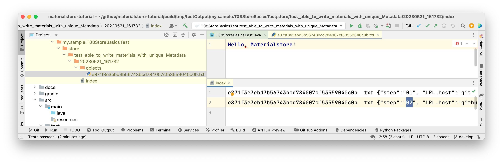

- Table of contents
{:toc}

# Materialstore Tutorial

-   [materialstore API javadoc](https://kazurayam.github.io/materialstore/api/index.html)

-   back to the [materialstore repository](https://github.com/kazurayam/materialstore)

This is an introduction to a Java library named `materialstore` that I (kazurayam) developed.

## Setting up a project

Here I assume you have a seasoned programming skill in Java, and you have installed the build tool [Gradle](https://gradle.org/install/). Now let us create a project where you write some Java code for practice.

I created a working directory under my home directory: `~/tmp/sampleProject`.

    $ cd ~/tmp/
    $ mkdir sampleProject

You want to initialize it as a Gradle project, so you would operate in the console as this:

    $ cd ~/tmp/sampleProject
    $ gradle init

    Select type of project to generate:
      1: basic
      2: application
      3: library
      4: Gradle plugin
    Enter selection (default: basic) [1..4] 1

    Select build script DSL:
      1: Groovy
      2: Kotlin
    Enter selection (default: Groovy) [1..2] 1

    Generate build using new APIs and behavior (some features may change in the next minor release)? (default

    Project name (default: sampleProject):

    > Task :init
    Get more help with your project: Learn more about Gradle by exploring our samples at https://docs.gradle.org/7.4.2/samples

    BUILD SUCCESSFUL in 28s

Then you will find a file `sampleProject/settings.gradle` has been created, which looks like:

**settings.gradle**

    rootProject.name = 'sampleProject'

You will also find a file `sampleProject/build.gradle` file, but it will be empty (comments only). So you want to edit it, like this.

**build.gradle**

    plugins {
        id 'java'
    }

    group 'com.kazurayam'
    version '0.3.0'

    repositories {
        mavenCentral()
        mavenLocal()
    }

    dependencies {
        testImplementation libs.inspectus
        testImplementation libs.slf4j.api
        testImplementation libs.selenium4
        testImplementation libs.ashotwrapper
        testImplementation libs.slf4j.simple
        testImplementation libs.webdrivermanager
        testImplementation libs.guava
        testImplementation libs.commonsio
        testImplementation libs.junit.jupiter.api
        testRuntimeOnly libs.junit.jupiter.engine

        //testImplementation group: 'com.kazurayam', name: 'materialstore', version: '0.16.6-SNAPSHOT'
        testImplementation group: 'com.google.guava', name: 'guava', version: '31.1-jre'
        testImplementation group: 'commons-io', name: 'commons-io', version: '2.12.0'
    }

    test {

Please note that in the build.gradle we declared the dependency to the `materialstore` library, which is published at the Maven Central repository.

-   <https://mvnrepository.com/artifact/com.kazurayam/materialstore>

You can check if the project is properly setup by executing a command, as follows:

    $ cd ~/tmp/sampleProject/
    $ gradle dependencies --configuration testImplementation

    > Task :dependencies

    ------------------------------------------------------------
    Root project 'materialstore-tutorial'
    ------------------------------------------------------------

    testImplementation - Implementation only dependencies for source set 'test'. (n)
    +--- com.kazurayam:materialstore:0.16.5 (n)
    +--- org.freemarker:freemarker:2.3.31 (n)
    +--- com.google.guava:guava:31.1-jre (n)
    +--- com.google.code.gson:gson:2.8.9 (n)
    +--- org.slf4j:slf4j-api:1.7.25 (n)
    +--- org.slf4j:slf4j-simple:1.7.25 (n)
    \--- org.junit.jupiter:junit-jupiter-api:5.9.2 (n)

    (n) - A dependency or dependency configuration that cannot be resolved.

    A web-based, searchable dependency report is available by adding the --scan option.

    BUILD SUCCESSFUL in 1s
    1 actionable task: 1 executed

## 1st example: "Hello, materialstore!"

We are going to read the code of

-   [my.sample.T01HelloMaterialstoreTest](https://github.com/kazurayam/materialstore-tutorial/blob/master/src/test/java/my/sample/T01HelloMaterialstoreTest.java)

This is a JUnit-based Java code that uses the materialstore library.

**T01HelloMaterialstoreTest.java**

    package my.sample;

    import com.kazurayam.materialstore.core.FileType;
    import com.kazurayam.materialstore.core.JobName;
    import com.kazurayam.materialstore.core.JobTimestamp;
    import com.kazurayam.materialstore.core.Material;
    import com.kazurayam.materialstore.core.MaterialstoreException;
    import com.kazurayam.materialstore.core.Metadata;
    import com.kazurayam.materialstore.core.Store;
    import com.kazurayam.materialstore.core.Stores;
    import org.junit.jupiter.api.BeforeEach;
    import org.junit.jupiter.api.Test;

    import java.io.IOException;
    import java.nio.file.Files;
    import java.nio.file.Path;
    import java.nio.file.Paths;

    import static org.junit.jupiter.api.Assertions.assertNotNull;

    /*
     * This code demonstrate how to save a text string into an instance of
     * "materialstore" backed with a directory on the local OS file system.
     */
    public class T01HelloMaterialstoreTest {

        // central abstraction of Material storage
        private Store store;

        @BeforeEach
        public void beforeEach() {
            // create a base directory
            Path dir = createTestClassOutputDir(this);   // (1)
            // create a directory named "store"
            Path storeDir = dir.resolve("store");   // (2)
            // instantiate a Store object
            store = Stores.newInstance(storeDir);        // (3)
        }

        @Test
        public void test01_hello_materialstore() throws MaterialstoreException {
            JobName jobName =
                    new JobName("test01_hello_materialstore");       // (4)
            JobTimestamp jobTimestamp = JobTimestamp.now();          // (5)
            String text = "Hello, materialstore!";
            Material material = store.write(jobName, jobTimestamp,   // (6)
                    FileType.TXT,                            // (7)
                    Metadata.NULL_OBJECT,                    // (8)
                    text);                                   // (9)
            System.out.printf("wrote a text '%s'%n", text);
            assertNotNull(material);
        }

        //-----------------------------------------------------------------

        Path createTestClassOutputDir(Object testClass) {
            Path output = getTestOutputDir()
                    .resolve(testClass.getClass().getName());
            try {
                if (!Files.exists(output)) {
                    Files.createDirectories(output);
                }
            } catch (IOException e) {
                throw new RuntimeException(e);
            }
            return output;
        }

        Path getTestOutputDir() {
            return Paths.get(System.getProperty("user.dir"))
                    .resolve("build/tmp/testOutput");
        }
    }

You can run this by running the `test` task of Gradle:

    $ gradle test --tests  my.sample.T1HelloMaterialstore -i
    > Task :compileJava NO-SOURCE
    > Task :processResources NO-SOURCE
    > Task :classes UP-TO-DATE
    > Task :compileTestJava
    > Task :processTestResources NO-SOURCE
    > Task :testClasses
    > Task :test

    BUILD SUCCESSFUL in 2s
    2 actionable tasks: 2 executed

The `test` task of Gradle will create a report in HTML format where you can find all output from the test execution. You can find the report at `build/reports/tests/test/index.html`.

    $ cd ~/tmp/sampleProject
    $ tree build/reports/tests/
    build/reports/tests/
    └── test
        ├── classes
        │   └── my.sample.T1HelloMaterialstoreTest.html
        ├── css
        │   ├── base-style.css
        │   └── style.css
        ├── index.html
        ├── js
        │   └── report.js
        └── packages
            └── my.sample.html

    5 directories, 6 files

You want to open the `index.html` in your Web browser to have a look at the test result.

<figure>

</figure>

### File tree created by "Hello, materialstore"

The 1st test will create a new file tree as output:

Let us read the Java source of the test `T1HelloMaterialstoreTest` line by line to understand the basic concept and classes of the "materialstore" library. Here I assume that you are a well-trained Java programmer who requires no explanation how to code this using JUnit.

### Create a base directory

    import java.nio.file.Path;
    ...
        @BeforeEach
        public void beforeEach() {
            Path dir = createTestClassOutputDir(this);   // (1)

The statement commented as (1) creates a directory `build/tmp/testOutput/<fully qualified class name>`. In this directory the test will save all output files during its run. The helper method `createTestClassOutputDir(Object)` is defined later in the source file.

### Create the "store" directory

            Path storeDir = dir.resolve("store");   // (2)

The statement (2) declares an instance of `java.nio.file.Path` class, store it into a variable `storeDir`. The Path object corresponds to the directory `build/tmp/testOutput/<fully qualified class name>/store`.

### Store class

    import com.kazurayam.materialstore.core.Store;
    ...

        private Store store;
    ...

            store = Stores.newInstance(storeDir);        // (3)

The statement (3) creates an instance of `com.kazurayam.materialstore.core.Store` class. The statement (3) will create a physical directory `store` if not yet present.

The `Store` class is the core part of the materialstore library. The `Store` class implements methods to write the materials into the OS file system. It also implements methods to select (=retrieve) one or more `Material` object(s) (=file) out of the store.

The `Stores` class is the factory that is capable of creating instance of the `Store` class.

### JobName class

    import com.kazurayam.materialstore.core.JobName;
    ...
        @Test
        public void test01_hello_materialstore() throws MaterialstoreException {
            JobName jobName =
                    new JobName("test01_hello_materialstore");       // (4)

The statement (4) declares the name of a subdirectory under the `store` directory. You can specify a string value as the parameter to the constructor of `com.kazurayam.materialstore.core.JobName` class. It is just a directory name; no deep semantic meaning is enforced. However, you should remember that some ASCII characters are prohibited as a part of file/directory names by the underlying OS; therefore you can not use them as the `JobName` object’s value. For example, Windows OS does not allow you to use the following characters:

-   `<` (less than)

-   `>` (greater than)

-   `:` (colon)

-   `"` (double quote)

-   `/` (forward slash)

-   `\` (backslash)

-   `|` (vertical bar or pipe)

-   `?` (question mark)

-   `*` (asterisk)

You can use non-latin characters as JobName. JobName can contain white spaces if necessary. For example, you can write:

        JobName jobName = new JobName("わたしの仕事 means my job");

### JobTimestamp class

    import com.kazurayam.materialstore.core.JobTimestamp;
    ...
            JobTimestamp jobTimestamp = JobTimestamp.now();          // (5)

The statement (5) declares the name of a new directory, which I will call as **JobTimestamp**, under a **JobName** directory. The JobTimestamp will be in a fixed format of `uuuuMMdd_hhmmss` (year, month, day, hours, minutes, seconds). A call to `JobTimestamp.now()` will return a JobTimestamp object which corresponds to a directory of which name stands for the current timestamp provided by OS.

The `JobTimestamp` class implements various methods that help you work on. See the [javadoc](https://kazurayam.github.io/materialstore/api/com/kazurayam/materialstore/core/JobTimestamp.html) for detail.

### create a file tree, write a "Material"

    import com.kazurayam.materialstore.core.FileType;
    import com.kazurayam.materialstore.core.Material;
    import com.kazurayam.materialstore.core.Metadata;
    ...
            String text = "Hello, materialstore!";
            Material material = store.write(jobName, jobTimestamp,   // (6)
                    FileType.TXT,                            // (7)
                    Metadata.NULL_OBJECT,                    // (8)
                    text);                                   // (9)

The lines (6) to (9) creates a file tree under the \`store\`directory, like this:

    $ cd build/tmp/testOutput/my.sample.T1HelloMaterialstoreTest/
    $ tree .
    store/
    └── test01_hello_materialstore
        └── 20221128_082216
            ├── index
            └── objects
                └── 4eb4efec3324a630e0d3d96e355261da638c8285.txt

The structure of the file tree under the `store` directory is specially designed to save the **Materials**. The tree structure is fixed: a file named `store/<JobName>/<JobTimestamp>/index` plus one or more files under the `store/<JobName>/<JobTimestamp>/objects/` directory. You are not suppose to **customize** this tructure. You would delegate all tasks of creating + naming + locating files and directories under the `store` directory to the `Store` object.

As the line commented as (6) tells, a "Material" (actually, is a file) is always saved under the sub-tree `store/<JobName>/<JobTimestamp>/objects`.

### File name of the Materials

All files under the `objects` have a fixed format of file name, that is:

**&lt;40 characters in alpha-numeric, calcurated by the SHA1 hash function&gt;.&lt;file extention&gt;**

for example, a Material could have a file name:

`4eb4efec3324a630e0d3d96e355261da638c8285.txt`

Ths `Store#write()` method call produces the leading 40 characters using the [SHA1](https://en.wikipedia.org/wiki/SHA-1) message digest function taking the byte array of the file content as the input. This cryptic 40 characters uniquely identifies the input files regardless which type of the file content: a plain text, CSV, HTML, JSON, XML, PNG image, PDF, zipped archive, MS Excel xlsx, etc. This 40 characters is called as `ID` of a Material.

**You are not supposed to specify the name on the file in the materialstore. The ID of a Material is calculated based on the file content by the `Store` class. A single byte change in the file content will result a completely different value of the `ID`.**

### FileType

The line (7) specifies `FileType.TXT`.

                    FileType.TXT,                            // (7)

\(7\) assigns a file extension `txt` to the file name. The `com.kazurayam.materialstore.FileType` enum declares many concrete FileType instances ready to use. See
[`com.kazurayam.materialstore.core.FileType`](https://kazurayam.github.io/materialstore/api/com/kazurayam/materialstore/core/FileType.html) for the complete list. You can also create your own class that implements `com.kazurayam.materialstore.IFileType`. See <https://kazurayam.github.io/materialstore/api/com/kazurayam/materialstore/core/IFileType.html>. You can use your custom FileType wherever a FileType enum is accepted.

### Metadata

You can associate various metadata to each Material instances. The URL string (e.g., "https://www.google.com/?q=selenium") is a typical metadata of a screenshot of a web page.

The `T01HelloMaterialstoreTest` does not really make use of the Metadata. So, I wrote `Metadata.NULL_OBJECT` to fill the required parameter.

                    Metadata.NULL_OBJECT,                (8)

I will cover how to make full use of Metadata later.

### Types of objects writeable into the Store

The javadoc of the [`Store`](https://kazurayam.github.io/materialstore/api/com/kazurayam/materialstore/core/filesystem/Store.html) shows that it can accept multiple types of object as input to write into the `store`:

-   `java.lang.String`

-   `byte[]`

-   `java.nio.file.Path`

-   `java.io.File`

-   `java.awt.image.BufferedImage`

These types will cover the most cases in your automated UI testing.

## 2nd example: write a Material with associated Metadata

We are going to read the code of

-   [my.sample.T03WriteImageWithMetadataTest](https://github.com/kazurayam/materialstore-tutorial/blob/master/src/test/java/my/sample/T02WriteImageWithMetadata.java)

<!-- -->

    public class T02WriteImageWithMetadataTest {

        private Store store;

        @BeforeEach
        public void beforeEach() {
            Path testClassOutputDir = TestHelper.createTestClassOutputDir(this);
            store = Stores.newInstance(testClassOutputDir.resolve("store"));
        }

        @Test
        public void test02_write_image_with_metadata() throws MaterialstoreException {
            JobName jobName = new JobName("test02_write_image_with_metadata");
            JobTimestamp jobTimestamp = JobTimestamp.now();
            URL url = SharedMethods.createURL(                     // (10)
                    "https://kazurayam.github.io/materialstore-tutorial/images/tutorial/03_apple.png");
            byte[] bytes = SharedMethods.downloadUrlToByteArray(url);         // (11)
            Material material =
                    store.write(jobName, jobTimestamp,             // (12)
                            FileType.PNG,
                            Metadata.builder(url)                  // (13)
                                    .put("step", "01")
                                    .put("label", "red apple")
                                    .build(),
                            bytes);

            assertNotNull(material);
            System.out.println(material.getID() + " "
                    + material.getDescription());                   // (14)

            assertEquals(FileType.PNG, material.getFileType());
            assertEquals("https",
                    material.getMetadata().get("URL.protocol"));
            assertEquals("kazurayam.github.io",
                    material.getMetadata().get("URL.host"));        // (15)
            assertEquals("/materialstore-tutorial/images/tutorial/03_apple.png",
                    material.getMetadata().get("URL.path"));
            assertEquals("01", material.getMetadata().get("step"));
        }
    }

At the line (10), we create an instance of `java.net.URL` with a String argument "<https://kazurayam.github.io/materialstore-tutorial/images/tutorial/03_apple.png>". You can click this URL to see the image yourself. You should see an apple.

I create a helper class named `my.sample.SharedMethod` with a method `createURL(String)` that instantiate an instance of `URL`.

**createURL(String)**

    public class SharedMethods {

        public static URL createURL(String urlString) throws MaterialstoreException {
            try {
                return new URL(urlString);
            } catch (MalformedURLException e) {
                throw new MaterialstoreException(e);

At the statement (11) we get access to the URL. We will effectively download a PNG image file from the URL and obtain a large array of bytes.
The `downloadURL(URL)` method of `SharedMethods` class implements this processing: converting a URL to an array of bytes.

**downloadUrl(URL)**

            }
        }

        public static byte[] downloadUrlToByteArray(URL toDownload) {
            ByteArrayOutputStream outputStream = new ByteArrayOutputStream();
            try {
                byte[] chunk = new byte[4096];
                int bytesRead;
                InputStream stream = toDownload.openStream();
                while ((bytesRead = stream.read(chunk)) > 0) {
                    outputStream.write(chunk, 0, bytesRead);
                }
            } catch (IOException e) {
                e.printStackTrace();
                return null;
            }
            byte[] bytes = outputStream.toByteArray();
            assert bytes.length != 0;
            return bytes;

The statement (12) invokes `store.write()` method, which create a new file tree, as this:

<figure>

</figure>

### Metadata attributes based on key-value pairs explicitly specified, plus attributes based on a URL

the `index` file contains a single line of text, which is something like:

**index**

    27b2d39436d0655e7e8885c7f2a568a646164280 png {"label":"red apple", "step":"01", "URL.host":"kazurayam.github.io", "URL.path":"/materialstore-tutorial/images/tutorial/03_apple.png", "URL.port":"80", "URL.protocol":"https"}

Please find a JSON-like string enclosed by a pair of curly braces (`{` and `}`). I call this section as **Metadata** of a material. The Metadata contains several **"key":"value"** pairs. The metadata was created as specified by the line (13).

            Metadata.builder(url)           // (13)
                    .put("step", "01")
                    .put("label", "red apple")
                    .build(),

The `url` variable contains an instance of `java.net.URL` class. You should check the [Javadoc of `URL`](https://docs.oracle.com/javase/7/docs/api/java/net/URL.html). The constructor `new URL(String spec)` can accept a string like "<https://kazurayam.github.io/materialstore/images/tutorial/03_apple.png>" and parse it into its lexical components: `protocol`, `host`, `port`, `path`, `query` and `fragment`. The `url` variable passed to the `Metadata.builder(url)` call is parsed by the URL class and transformed into a set of key-value pairs like `"URL.hostname": "kazurayam.github.io"`.

Let me show you a few more examples.

The URL string
`"https://duckduckgo.com/?q=materialstore+kazurayam&atb=v314-1&ia=images"` will make the following Metadata instance:

    {"URL.host":"duckduckgo.com", "URL.path":"/", "URL.port":"80", "URL.protocol":"https", "URL.query":"q=materialstore+kazurayam&atb=v314-1&ia=images"}

The URL string `"https://kazurayam.github.io/materialstore-tutorial/#first-sample-code-hello-materialstore"` will make the following Metadata instance:

    {"URL.fragment":"first-sample-code-hello-materialstore", URL.host":"kazurayam.github.io", "URL.path":"/materialstore-tutorial", "URL.port":"80", "URL.protocol":"https"}

### Order of key-value pairs in Metadata

the key-value pairs in the pair of curly braces (`{` .. `}`) are arranged by the "key". Unless explicitly specified, the "keys" are sorted by the ascending order as string. Therefore, in the above example, the key `URL.fragment` comes first, the key "URL.protocol" comes last.

### key:value pairs explicitly specified

The line (13) explicitly created 2 pairs of **key:value**, that is `"step": "01"` and `"label":"red apple"`.

You can create **key:value** pairs as many as you want. Both of key and value must be String type. No number, no boolean values are allowed. The **key** can be any string, the **value** can be any string as well. You can use any characters including `/` (forward slash), `\` (back slash), `:` (colon). You can use non-ASCII characters. For example: you can create a key-value pair `"番号": "123/456 xyz"`. The Character escaping rule of JSON applies here: a double quote character `"` will be escaped to `\"`; a back-slash character `\` will be escaped to be `\\`.

Metadata is stored in the `index` file, which is apart from the material file itself. The byte array downloaded from a URL is not altered at all. The byte array is saved into a file in the `objects` directory as is. And then, you can associate a Metadata to each individual materials. What sort of Metadata to associate? --- it is completely up to you.

Metadata plays an important role later when you start compiling advanced reports "Chronos Diff" and "Twins Diff".

### Retrieving information of a Material

The line (14) prints the summarized information of the material: the ID, the FileType, and the Metadata.

You can also get various information out of the `material` variable. For example, the line (15) retrieves the value of `"URL.host"` out of the material object, compares it with an expected value.

            assertEquals("kazurayam.github.io",
                    material.getMetadata().get("URL.host"));        // (15)

Please check the [Javadoc of Material](https://kazurayam.github.io/materialstore/api/com/kazurayam/materialstore/core/Material.html) for what sort of accessor methods are implemented.

## 3rd example: writing multiple Materials

We are going to read the code of

-   [my.sample.T03WriteMultipleImagesTest](https://github.com/kazurayam/materialstore-tutorial/blob/master/src/test/java/my/sample/T03WriteMultipleImagesTest.java)

This class downloads 3 PNG image files from public URL and store them into the store on the local disk.

    public class T03WriteMultipleImagesTest {
        private Store store;
        @BeforeEach
        public void beforeEach() {
            Path testClassOutputDir = TestHelper.createTestClassOutputDir(this);
            store = Stores.newInstance(testClassOutputDir.resolve("store"));
        }

        @Test
        public void test03_write_multiple_images()
                throws MaterialstoreException {
            JobName jobName = new JobName("test03_write_multiple_images");
            JobTimestamp jobTimestamp = JobTimestamp.now();
            SharedMethods.write3images(store, jobName, jobTimestamp);  // (16)
            MaterialList allMaterialList =
                    store.select(jobName, jobTimestamp,
                            QueryOnMetadata.ANY);                      // (17)
            assertEquals(3, allMaterialList.size());
        }
    }

This code calls `SharedMethods.write3images(Store, JobName, JobTimestap)` method. It is implemented as this:

**SharedMethod.write3images**

        public static void write3images(Store store, JobName jn, JobTimestamp jt)          // (16)
                throws MaterialstoreException {
            String prefix =
                    "https://kazurayam.github.io/materialstore-tutorial/images/tutorial/";
            // Apple
            URL url1 = SharedMethods.createURL(prefix + "03_apple.png");
            store.write(jn, jt, FileType.PNG,
                    Metadata.builder(url1)
                            .put("step", "01")
                            .put("label", "red apple")
                            .build(),
                    SharedMethods.downloadUrlToByteArray(url1));

            // Mikan
            URL url2 = SharedMethods.createURL(prefix + "04_mikan.png");
            Map<String, String> m = new HashMap<>();
            m.put("step", "02");
            m.put("label", "mikan");
            store.write(jn, jt, FileType.PNG,
                    Metadata.builder(url2)
                            .putAll(m)
                            .build(),
                    SharedMethods.downloadUrlToByteArray(url2));

            // Money
            URL url3 = SharedMethods.createURL(prefix + "05_money.png");
            store.write(jn, jt, FileType.PNG,
                    Metadata.builder(url3)
                            .exclude("URL.protocol", "URL.port")
                            .putAll(ImmutableMap.of("step", "03",
                                    "label", "money"))
                            .build(),
                    SharedMethods.downloadUrlToByteArray(url3));
        }

This code makes HTTP requests to the following URLs:

-   <http://kazurayam.github.io/materialstore-tutorial/images/tutorial/03_apple.png>

-   <http://kazurayam.github.io/materialstore-tutorial/images/tutorial/04_mikan.png>

-   <http://kazurayam.github.io/materialstore-tutorial/images/tutorial/05_money.png>

> The 3 images are contributed by R-DESIGN, たくらだ猫 and 川流。I quoted the original URL in their graphics. Thanks for their artworks.

This code will save the image files into a directory inside the `store` directory. When you run this test, you will get a new file tree as follows.

The `index` file will contain 3 lines, one for each PNG image file.

**index**

    $ cat build/tmp/testOutput/my.sample.T03WriteMultipleImagesTest/store/test03_write_multiple_images/20230518_101746/index
    8a997bec64cd056c2075da95c0c281320ee7a7c1        png     {"label":"mikan", "step":"02", "URL.host":"kazurayam.github.io", "URL.path":"/materialstore-tutorial/images/tutorial/04_mikan.png", "URL.port":"80", "URL.protocol":"https"}
    36f9f62bdb3ad45cb8c6bc1f4062fbbd4fd180db        png     {"label":"money", "step":"03", "URL.host":"kazurayam.github.io", "URL.path":"/materialstore-tutorial/images/tutorial/05_money.png"}
    27b2d39436d0655e7e8885c7f2a568a646164280        png     {"label":"red apple", "step":"01", "URL.host":"kazurayam.github.io", "URL.path":"/materialstore-tutorial/images/tutorial/03_apple.png", "URL.port":"80", "URL.protocol":"https"}

Let’s read the code and the index entries and find the details.

### Metadata.Builder.put(String key, String value)

                    Metadata.builder(url1)
                            .put("step", "01")
                            .put("label", "red apple")
                            .build(),

The above code generated the following Metadata instance:

    {"label":"red apple", "step":"01", "URL.host":"kazurayam.github.io", "URL.path":"/materialstore-tutorial/images/tutorial/03_apple.png", "URL.port":"80", "URL.protocol":"https"}

`Metadata.builder(url)` resulted 4 attributes derived from the argument of URL: "URL.host", "URL.path", "URL.port" and "URL.protocol".

Other 2 attributes "label" and "step" were created by multiple calls to `.put(String key, String value)`. You can add less or more attributes. You can give any values. The value can be of non US ASCII characters; such as "日本語", "français", "русские".

### Metadata.Builder.putAll(Map&lt;String,String&gt;)

Instead of calling `.put(String key, String value)` multiple times, you can all `.putAll(Map<String, String>)`, as the sample code does:

            Map<String, String> m = new HashMap<>();
            m.put("step", "02");
            m.put("label", "mikan");
            store.write(jn, jt, FileType.PNG,
                    Metadata.builder(url2)
                            .putAll(m)
                            .build(),
                    SharedMethods.downloadUrlToByteArray(url2));

The above code does not look very stylish.　Creating an instance of HashMap class is verbose; unfortunately Java language does not have a Map literal like JSON `{"label": "mikan", "step": "i02"}`). As the second best, you can rewrite this code as follows using Google’s [Guava](https://github.com/google/guava):

    import com.google.common.collect.ImmutableMap;
    ...
            store.write(jn, jt, FileType.PNG,
                    Metadata.builder(url2)
                            .putAll(ImmutableMap.of(
                                    "step", "02",
                                    "label", "mikan"))
                            .build(),
                    SharedMethods.downloadUrlToByteArray(url2));

### Metadata.Builder.exclude(String keys…​)

`Metadata.builder(url)` generates multiple attributes like: `"URL.host":"kazurayam.github.io", "URL.path":"/materialstore-tutorial/images/tutorial/04_mikan.png", "URL.port":"80", "URL.protocol":"https"`. `URL.host` and `URL.path` are always informative. But the `URL.port` is usually `80`, the `URL.protocol` will be either of `http` or `https`. You can exclude any attributes by calling `.exclude(String key…​)`. The following code shows how to:

            store.write(jn, jt, FileType.PNG,
                    Metadata.builder(url3)
                            .exclude("URL.protocol", "URL.port")
                            .putAll(ImmutableMap.of("step", "03",
                                    "label", "money"))
                            .build(),

This code generates a Metadata like this:

    {"label":"money", "step":"03", "URL.host":"kazurayam.github.io", "URL.path":"/materialstore-tutorial/images/tutorial/05_money.png"}

Please note that `URL.host` and `URL.path` are included but `URL.protocol` and `URL.port` are excluded.

### Order of lines in the "index" file

Let’s look at the `index` file. It is a text file with 1 or more lines. In which order the lines are ordered?

**index**

    8a997bec64cd056c2075da95c0c281320ee7a7c1        png     {"label":"mikan", ...
    36f9f62bdb3ad45cb8c6bc1f4062fbbd4fd180db        png     {"label":"money", ...
    27b2d39436d0655e7e8885c7f2a568a646164280        png     {"label":"red apple", ...

Obviously the ID, 40 hex-decimal characters, is not the primary key of sorting the lines.

The primary sorting key is the entire String representation of Metadata.

1.  `{"label":"mikan", …​`

2.  `{"label":"money", …​`

3.  `{"label":"red apple", …​`

As you seem the strings are sorted in the ascending order: `mi` &lt; `mo` &lt; `re`.

The order of attributes in the Metadata is significant. Let’s assume that we could place the `step` attribute comes left-most, then the order of lines will change:

    27b2d39436d0655e7e8885c7f2a568a646164280        png     {"step":"01", "label":"red apple", "URL.host":"kazurayam.github.io", "URL.path":"/materialstore-tutorial/images/tutorial/03_apple.png", "URL.port":"80", "URL.protocol":"https"}
    8a997bec64cd056c2075da95c0c281320ee7a7c1        png     {"step":"02", "label":"mikan", "URL.host":"kazurayam.github.io", "URL.path":"/materialstore-tutorial/images/tutorial/04_mikan.png", "URL.port":"80", "URL.protocol":"https"}
    36f9f62bdb3ad45cb8c6bc1f4062fbbd4fd180db        png     {"step":"03", "label":"money", "URL.host":"kazurayam.github.io", "URL.path":"/materialstore-tutorial/images/tutorial/05_money.png"}

## 4th example: retrieving a single Material from the store

We are going to read the code of

-   [my.sample.T04SelectASingleMaterialWithQueryTest](https://github.com/kazurayam/materialstore-tutorial/blob/master/src/test/java/my/sample/T04SelectASingleMaterialWithQueryTest.java)

<!-- -->

        @Test
        public void test04_select_a_single_material_with_query()
                throws MaterialstoreException {
            JobName jobName =
                    new JobName("test04_select_a_single_material_with_query");
            JobTimestamp jobTimestamp = JobTimestamp.now();
            SharedMethods.write3images(store, jobName, jobTimestamp);
            //
            Material material =
                    store.selectSingle(jobName, jobTimestamp,
                            QueryOnMetadata.builder().put("step", "02").build()); // (20)
            assertNotNull(material);

            System.out.printf("%s %s\n\n",
                    material.getFileType().getExtension(),
                    material.getMetadata().getMetadataIdentification());

            System.out.printf("%s '%s' %s\n\n",
                    material.getMetadata().get("step"),
                    material.getMetadata().get("label"),
                    material.getMetadata().toURLAsString());
        }
    }

This test retrieves a single Material object which has a Metadata of `"step": "02"`.This test emits the following output:

    > Task :test
    png {"label":"mikan", "step":"02", "URL.host":"kazurayam.github.io", "URL.path":"/materialstore-tutorial/images/tutorial/04_mikan.png", "URL.port":"80", "URL.protocol":"https"}

    02 'mikan' https://kazurayam.github.io/materialstore-tutorial/images/tutorial/04_mikan.png

    BUILD SUCCESSFUL in 2s

For detail, have a look at javadocs:

-   [com.kazurayam.materialstore.core.Store#selectSingle(JobName, JobTimestamp, QueryOnMetadata)](https://kazurayam.github.io/materialstore/api/com/kazurayam/materialstore/core/Store.html#selectSingle(com.kazurayam.materialstore.core.JobName,com.kazurayam.materialstore.core.JobTimestamp))

-   [com.kazurayam.materialstore.core.Material](https://kazurayam.github.io/materialstore/api/com/kazurayam/materialstore/core/Material.html)

-   [com.kazurayam.materialstore.core.Metadata](https://kazurayam.github.io/materialstore/api/com/kazurayam/materialstore/core/Metadata.html)

-   [com.kazurayam.materialstore.core.QueryOnMetadata](https://kazurayam.github.io/materialstore/api/com/kazurayam/materialstore/core/QueryOnMetadata.html)

## 5th example: Selecting a List of Materials

We are going to read the code of

-   [my.sample.T05SelectMaterialListTest](https://github.com/kazurayam/materialstore-tutorial/blob/master/src/test/java/my/sample/T05SelectMaterialListTest.java)

### Selecting all Materials in a JobName/JobTimestamp directory

Specifying `QueryOnMetadata.ANY` means you do not differentiates them by Metadata.

        @Test
        public void test05_select_list_of_material() throws MaterialstoreException {
            JobName jobName = new JobName("test05_select_lest_of_materials");
            JobTimestamp jobTimestamp = JobTimestamp.now();
            SharedMethods.write3images(store, jobName, jobTimestamp);
            MaterialList materialList =
                    store.select(jobName, jobTimestamp,
                            QueryOnMetadata.ANY);              // (18)
            for (Material material : materialList) {           // (19)
                System.out.printf("%s %s\n",
                        material.getFileType().getExtension(),
                        material.getMetadata().getMetadataIdentification());
                System.out.printf("%s '%s' %s\n\n",
                        material.getMetadata().get("step"),
                        material.getMetadata().get("label"),
                        material.getMetadata().toURLAsString());
            }

### Variations of Store.select(…​) methods

[`Store.select(…​)`](https://kazurayam.github.io/materialstore/api/com/kazurayam/materialstore/core/Store.html#select(com.kazurayam.materialstore.core.JobName,com.kazurayam.materialstore.core.JobTimestamp)) method returns an instance of [com.kazurayam.materialstore.core.MaterialList](https://kazurayam.github.io/materialstore/api/com/kazurayam/materialstore/core/MaterialList.html), which is a list of Materials retrieved from the store.

The `Store.select(…​)` methods has several variation of arguments:

-   select(JobName, JobTimestamp)

-   select(JobName, JobTimestamp, QueryOnMetadata)

-   select(JobName, JobTimestamp, FileType)

-   select(JobName, JobTimestamp, FileType, QueryOnMetadata)

You can specify selection criteria as the parameters to these method call.

### Selecting Materials with QueryOnMetadata specified with exact match

[QueryOnMetadata](https://kazurayam.github.io/materialstore/api/com/kazurayam/materialstore/core/QueryOnMetadata.html) is something like [Metadata](https://kazurayam.github.io/materialstore/api/com/kazurayam/materialstore/core/Metadata.html). QueryOnMetadata is a collection **key=value** pairs. You can make a query for Materials with Metadata that matches with the QueryOnMetadata object.

For example, the following code shows how to get a MaterialList which contains Materials with its `label` attribute is exactly equal to `mikan`.

        @Test
        public void test05_select_with_query() throws MaterialstoreException {
            JobName jobName = new JobName("test05_select_with_query");
            JobTimestamp jobTimestamp = JobTimestamp.now();
            SharedMethods.write3images(store, jobName, jobTimestamp);
            MaterialList materialList =
                    store.select(jobName, jobTimestamp,
                            QueryOnMetadata.builder().put("label", "mikan") // (20)
                                    .build());
            assertEquals(1, materialList.size());

### Selecting Materials using Regular Expression

You can also use Regular Expression to match against the value of Metadata of Materials.

        @Test
        public void test05_select_with_Regex() throws MaterialstoreException {
            JobName jobName = new JobName("test05_select_with_Regex");
            JobTimestamp jobTimestamp = JobTimestamp.now();
            SharedMethods.write3images(store, jobName, jobTimestamp);
            MaterialList materialList =
                    store.select(jobName, jobTimestamp,
                            QueryOnMetadata.builder()
                                    .put("label",
                                            Pattern.compile("m[a-z]+")) // (21)
                                    // "mikan" and "money" will match,
                                    // but "red apple" won't
                                    .build());
            assertEquals(2, materialList.size());
        }

## 6th example: generate an HTML report of a MaterialList

We are going to read the code of

-   [my.sample.T06MaterialListReportTest](https://github.com/kazurayam/materialstore-tutorial/blob/master/src/test/java/my/sample/T06MaterialListReportTest.java)

Once you saved several screenshots into the store, you would frequently want to review them. You would want to look the images associated with various metadata. The following code shows how to compile an HTML that renders 3 PNG images with metadata.

    public class T06MaterialListReportTest {
        private Store store;
        @BeforeEach
        public void beforeEach() {
            Path testClassOutputDir = TestHelper.createTestClassOutputDir(this);
            store = Stores.newInstance(testClassOutputDir.resolve("store"));
        }

        @Test
        public void test06_makeMaterialListReport() throws MaterialstoreException {
            JobName jobName =
                    new JobName("test06_makeMaterialListReport");
            JobTimestamp jobTimestamp = JobTimestamp.now();
            // write 3 PNG files into the store
            SharedMethods.write3images(store, jobName, jobTimestamp);

            MaterialList materialList =
                    store.select(jobName, jobTimestamp,
                            QueryOnMetadata.ANY);

            Inspector inspector = Inspector.newInstance(store);  // (22)
            inspector.setSortKeys(new SortKeys("step"));   // (23)

            Path report = inspector.report(materialList);        // (24)
            assertNotNull(report);
            System.out.println("report is found at " + report);
        }
    }

Running this JUnit5 test will result a new file tree at `build/tmp/testOutput/my.sample.T06MaterialListReportTest/`. It will look somehting like this:

    build/tmp/testOutput/my.sample.T06MaterialListReportTest/
    └── store
        ├── test06_makeMaterialListReport
        │   └── 20230519_172740
        │       ├── index
        │       └── objects
        │           ├── 27b2d39436d0655e7e8885c7f2a568a646164280.png
        │           ├── 36f9f62bdb3ad45cb8c6bc1f4062fbbd4fd180db.png
        │           └── 8a997bec64cd056c2075da95c0c281320ee7a7c1.png
        └── test06_makeMaterialListReport-20230519_172740.html

The top page shows a list of Materials.

<figure>

</figure>

You can click one of the rows to open it. When opened, you can see the PNG image is rendered.

<figure>

</figure>

The location and the name of the report HTML is fixed. The report HTML file will be located immediately under the `store` directory. The file name will be in the format of `store/<JobName>-<JobTimestamp>.html`.

## 7th example: various JobTimestamp operations

We are going to read the code of

-   [my.sample.T07JobTimestampOperationsTest](https://github.com/kazurayam/materialstore-tutorial/blob/master/src/test/java/my/sample/T07JobTimestampOperationsTest.java)

The `store` directory has a unified format of sub-directories like this:

    $ tree -L 4 .
    .
    └── store
        ├── test05_select_lest_of_materials
        │   └── 20230519_143612
        │       ├── index
        │       └── objects
        ├── test05_select_with_Regex
        │   ├── 20230519_164822
        │   │   ├── index
        │   │   └── objects
        │   └── 20230519_164834
        │       ├── index
        │       └── objects
        └── test05_select_with_RegularExpression
            └── 20230519_150156
                ├── index
                └── objects

The tree has a fixed subdirectory structure:

-   `store/<JobName>/<JobTimestamp>/index`

-   `store/<JobName>/<JobTimestamp>/objects`

This directory structure is convenient to store the web resources (screenshot images, etc) downloaded from the remote services during our automated Web UI tests.

The `<JobName>` directory will be the top level classification of the downloaded resources. Obviously the `<JobName>` directory will represent which set of test scripts created it. And `<JobTimestamp>` directory will represent the timing when we execute the test.

The `com.kazurayam.materialstore.core.JobTimestamp` class implements a rich set of methods to create/modify/inspect instances. Let me cover them with sample codes.

### Constructing a JobTimestamp that represents the current timestamp

        @Test
        public void test_now() {
            JobTimestamp now = JobTimestamp.now();
            System.out.println("now=" + now.toString());
        }

### Constructing a JobTimestamp with String argument

        @Test
        public void test_constructor_from_string() {
            String ts = "20230519_204902";
            JobTimestamp jt = new JobTimestamp(ts);
            assertEquals(ts, jt.toString());
        }

### Constructing a JobTimestamp with LocalDateTime argument

        @Test
        public void test_constructor_from_LocalDateTime() {
            LocalDateTime now = LocalDateTime.now();
            JobTimestamp jt = JobTimestamp.create(now);
            System.out.println("jt=" + jt.toString());
        }

### Getting a LocalDateTime out of a JobTimestamp object

        @Test
        public void test_value() {
            JobTimestamp jt = JobTimestamp.now();
            LocalDateTime ldt = jt.value();
            System.out.println("ldt=" + ldt.toString());
        }

### Verifying if a String is in a valid JobTimestamp format

        @Test
        public void test_isValid() {
            assertTrue(JobTimestamp.isValid("20230516_030405"));
            assertFalse(JobTimestamp.isValid("this is not a valid JobTimestamp"));
        }

### Equals method

        @Test
        public void test_equals() {
            JobTimestamp jt1 = new JobTimestamp("20230516_000000");
            JobTimestamp jt2 = new JobTimestamp("20230516_030405");
            JobTimestamp jt3 = new JobTimestamp("20230516_030405");
            assertFalse(jt1.equals(jt2));
            assertTrue(jt2.equals(jt3));
        }

### CompareTo method

        @Test
        public void test_compareTo() {
            JobTimestamp jt1 = new JobTimestamp("20230516_000000");
            JobTimestamp jt2 = new JobTimestamp("20230516_030405");
            JobTimestamp jt3 = new JobTimestamp("20230516_030405");
            assertTrue(jt1.compareTo(jt2) < 0);
            assertTrue(jt2.compareTo(jt3) == 0);
            assertTrue(jt2.compareTo(jt1) > 0);
        }

### Finding the maximum value

        @Test
        public void test_max() {
            JobTimestamp jt1 = new JobTimestamp("20220216_070203");
            JobTimestamp jt2 = new JobTimestamp("20230516_010800");
            JobTimestamp max = JobTimestamp.max(jt1, jt2);
            assertEquals(jt2, max);
        }

### plus operations

        @Test
        public void test_plus() {
            JobTimestamp base = new JobTimestamp("20230516_010800");
            JobTimestamp calc = base.plusDays(1).plusHours(2)
                    .plusMinutes(3).plusSeconds(4);
            assertEquals(new JobTimestamp("20230517_031104"), calc);
        }

### minus operations

        @Test
        public void test_minus() {
            JobTimestamp base = new JobTimestamp("20230516_111810");
            JobTimestamp calc = base.minusDays(1).minusHours(2)
                    .minusMinutes(3).minusSeconds(4);
            assertEquals(new JobTimestamp("20230515_091506"), calc);
        }

### Getting the end of the month

        @Test
        public void test_endOfTheMonth() {
            JobTimestamp base = new JobTimestamp("20230516_111810");
            assertEquals(new JobTimestamp("20230531_235959"),
                    base.endOfTheMonth());
        }

### Getting the beginning of the month

        @Test
        public void test_beginningOfTheMonth() {
            JobTimestamp base = new JobTimestamp("20230516_111810");
            assertEquals(new JobTimestamp("20230501_000000"),
                    base.beginningOfTheMonth());
        }

### Getting the difference seconds between 2 JobTimestamp objects

        @Test
        public void test_betweenSeconds() {
            JobTimestamp jt1 = new JobTimestamp("20230516_000000");
            JobTimestamp jt2 = new JobTimestamp("20230516_030405");
            assertEquals(3 * 60 * 60 + 4 * 60 + 5,
                    JobTimestamp.betweenSeconds(jt1, jt2));
        }

### Creating a JobTimestamp later than the given base JobTimestamp

        @Test
        public void test_laterThan() {
            JobTimestamp base = JobTimestamp.now();
            JobTimestamp jt1 = JobTimestamp.laterThan(base);
            JobTimestamp jt2 = JobTimestamp.laterThan(base, jt1);
            System.out.println(String.format("base=%s, jt1=%s, jt2=%s",
                    base.toString(), jt1.toString(), jt2.toString()));
        }

### Compare a JobTimestamp against a base JobTimestamp to find one newer than the base

        @Test
        public void test_theTimeOrLaterThan() {
            JobTimestamp thanThis = new JobTimestamp("20230516_010101");
            JobTimestamp theTime  = new JobTimestamp("20230516_010102");
            assertEquals(theTime,
                    JobTimestamp.theTimeOrLaterThan(thanThis, theTime));
            //
            thanThis = new JobTimestamp("20230516_010102");
            theTime  = new JobTimestamp("20230516_010101");
            assertEquals(new JobTimestamp("20230516_010103"),
                    JobTimestamp.theTimeOrLaterThan(thanThis, theTime));
        }

## 8th example: the Store class basics

We will read the code of [my.sample.T08StoreBasicsTest](https://github.com/kazurayam/materialstore-tutorial/blob/develop/src/test/java/my/sample/T08StoreBasicsTest.java)

The [com.kazurayam.materialstore.core.Store](https://kazurayam.github.io/materialstore/api/com/kazurayam/materialstore/core/Store.html) class create the `store` directory and the directory structure under it. The class implements methods to operate the `store` --- write a byte array into the store to make it a Material; read the byte array from a Material; list the JobNames contained, list the JobTimestamps contained, list the Materials contained. copy the Materials; delete the Materials, the JobTimestamp directory and the JobName directory. Have a quick look at the sample codes that utilize the `Store` class. Then you will understand it is a convenient helper dedicated to manage the web resources (page screenshots, HTML, JSON and XML text and so on) downloaded from the web services.

### Create a directory tree under the store to write a Material

The following code shows how to create a "store" directory, a directory tree with JobName and JobTimestamp under the "store", and write a Material.

    package my.sample;

    import com.kazurayam.materialstore.core.DuplicatingMaterialException;
    import com.kazurayam.materialstore.core.FileType;
    import com.kazurayam.materialstore.core.JobName;
    import com.kazurayam.materialstore.core.JobNameNotFoundException;
    import com.kazurayam.materialstore.core.JobTimestamp;
    import com.kazurayam.materialstore.core.Material;
    import com.kazurayam.materialstore.core.MaterialList;
    import com.kazurayam.materialstore.core.MaterialstoreException;
    import com.kazurayam.materialstore.core.Metadata;
    import com.kazurayam.materialstore.core.QueryOnMetadata;
    import com.kazurayam.materialstore.core.Store;
    import com.kazurayam.materialstore.core.Stores;
    import org.apache.commons.io.FileUtils;
    import org.junit.jupiter.api.BeforeAll;
    import org.junit.jupiter.api.BeforeEach;
    import org.junit.jupiter.api.Test;
    import org.slf4j.Logger;
    import org.slf4j.LoggerFactory;

    import java.io.IOException;
    import java.net.MalformedURLException;
    import java.net.URL;
    import java.nio.file.Files;
    import java.nio.file.Path;
    import java.nio.file.Paths;
    import java.util.List;

    import static org.junit.jupiter.api.Assertions.assertEquals;
    import static org.junit.jupiter.api.Assertions.assertFalse;
    import static org.junit.jupiter.api.Assertions.assertNotNull;
    import static org.junit.jupiter.api.Assertions.assertTrue;

    public class T08StoreBasicsTest {

        private static final Logger logger = LoggerFactory.getLogger(T08StoreBasicsTest.class);
        private static Path projectDir;
        private static Path outputDir;
        private Path root;
        private Store store;

        @BeforeAll
        public static void beforeAll() throws IOException {
            projectDir = Paths.get(".").toAbsolutePath();
            outputDir = projectDir.resolve("build/tmp/testOutput")
                    .resolve(T08StoreBasicsTest.class.getName());
            if (Files.exists(outputDir)) {
                FileUtils.deleteDirectory(outputDir.toFile());
            }
            Files.createDirectories(outputDir);
        }

        @BeforeEach
        public void beforeEach() {
            root = outputDir.resolve("store");
            store = Stores.newInstance(root);
        }

        @Test
        public void test_write_a_Material_into_the_store() throws MaterialstoreException {
            URL url = SharedMethods.createURL(
                    "https://kazurayam.github.io/materialstore-tutorial/images/tutorial/03_apple.png");
            // download the image into byte[]
            byte[] bytes = SharedMethods.downloadUrlToByteArray(url);
            // write the byte[] into the store
            JobName jobName = new JobName("test_write_a_Material_into_the_store");
            JobTimestamp jobTimestamp = JobTimestamp.now();
            Metadata metadata = Metadata.builder(url).build();
            // write a Material into the store
            // the directory tree of "store/jobName/jobTimestamp" will be automatically created
            Material m = store.write(jobName, jobTimestamp, FileType.PNG, metadata, bytes);
            assertNotNull(m, "m should not be null");
            System.out.printf("%s\t%s\t%s%n",
                    m.getID(),

The `T08StoreBasicsTest` class calls the method of [my.sample.SharedMethods](https://github.com/kazurayam/materialstore-tutorial/blob/master/src/test/java/my/sample/SharedMethods.java) class. Read its code as well.

By executing this code, the following directory tree will be created:

    $ tree build/tmp/testOutput/my.sample.T08StoreBasicsTest/
    build/tmp/testOutput/my.sample.T08StoreBasicsTest/
    └── store
        └── test_write_a_Material_into_the_store
            └── 20230520_181718
                ├── index
                └── objects
                    └── 27b2d39436d0655e7e8885c7f2a568a646164280.png

In the above tree, you can find some variable parts and fixed parts:

-   **store** `/` **JobName** `/` **JobTimestamp** `/index`

-   **store** `/` **JobName** `/` **JobTimestamp** `/objects/` **40 hex-decimal character** `.` **extension**

The top directory can have any name, but I usually name it `store`.

The file name `index` is fixed. The `index` file is created by the Store object. Programmers are not supposed to change it directly.

The **JobName** can be any name, but there are a few characters that are not allowed as file name by OS. For example, a slash `/` is not allowed.

The **JobTimestamp** is a string of fix 15 characters: 4 digits as Year (e.g, `2023`), 2 digits as Month (`01`-`12`), 2 digits as Day (`01`-`31`), an under bar `_`, 2 digits as Hours (`00`- `23`), 2 digits as Minutes (`00`-`59`), 2 digits as Seconds (`00`-`59`). Exceptionally, **JobTimestamp** can be a single under bar character ( \_ ), which means the "unspecified".

The directory name `objects` is fixed. Under the `objects`

The name of the files under the `objects` directory is a concatenation of 40 hex-decimal characters derived from the content by SHA1 Message signature algorithm appended with `.` and the **extension**.

The **extension** is something you all know: `txt`, `png`, `jpg`, `json`, `html`, `css`, `html`, `json`, `xml`, etc. The [`com.kazurayam.materialstore.core.FileSystem`](https://github.com/kazurayam/materialstore/blob/develop/src/main/java/com/kazurayam/materialstore/core/FileType.java) defines the supported extensions. The **extension** makes it possible to open each files by a double click action in the Windows Explorer GUI.

The **store** directory may contain multiple **JobName** directories. A **JobName** directory may contain multiple **JobTimestamp** directories. A **JobTimestamp** will contain a single `index` file. An `objects` directory may contain multiple files.

### Read the content of a single Material as a byte\[\]

You can read the content of a Material as file by calling `Store.read(Material)` method.

                    m.getFileType().getExtension(),
                    m.getMetadata().getMetadataIdentification().getIdentification());
        }

        @Test
        public void test_read_bytes_from_Material() throws MaterialstoreException {
            URL url = SharedMethods.createURL(
                    "https://kazurayam.github.io/materialstore-tutorial/images/tutorial/03_apple.png");
            byte[] bytes = SharedMethods.downloadUrlToByteArray(url);
            JobName jobName = new JobName("test_read_bytes_from_Material");
            JobTimestamp jobTimestamp = JobTimestamp.now();
            Metadata metadata = Metadata.builder(url).build();
            Material m = store.write(jobName, jobTimestamp, FileType.PNG, metadata, bytes);

### Reading all lines of a Material as text

Provided that a Material is a text file, you can read all lines into a `List<String>` by `Store.reaAllLines(Material)`.

            byte[] content = store.read(m);
            assertTrue(content.length > 0);
        }

        @Test
        public void test_readAllLines_from_Material() throws MaterialstoreException {
            JobName jobName = new JobName("test_readAllLines_from_Material");
            JobTimestamp jobTimestamp = JobTimestamp.now();
            Material m = store.write(jobName, jobTimestamp, FileType.TXT,
                    Metadata.NULL_OBJECT, "aaa\nbbb\nccc\n");
            List<String> lines = store.readAllLines(m);

If the Material is a binary file (not a text file) then a MaterialstoreException which wraps an IOException will be raised.

### Listing all JobNames in a Store

Under a `store` directory, there could be zero or more **JobName** directories. Then you would naturally want to get a list of the **JobNames**. You can get it by calling `store.findAllJobNames()`.

                System.out.println(line);
            }
        }

        @Test
        public void test_findAllJobNames() throws MaterialstoreException {
            // create test fixtures
            JobName jobName = new JobName("test_findAllJobNames");
            JobTimestamp jobTimestamp = JobTimestamp.now();
            SharedMethods.write3images(store, jobName, jobTimestamp);
            // list all JobNames in the store
            List<JobName> allJobNames = store.findAllJobNames();

You would see, for example, the following output in the console:

    > Task :test
    test_findAllJobNames
    BUILD SUCCESSFUL in 2s

### Listing all JobTimestamps in a JobName directory

Under a **JobName** directory, there could be zero or more **JobTimestamp** directories. Then you would naturally want to get a list of the **JobTimestamps**. You can get it by calling `store.findAllJobTimestamps()`.

                System.out.println(jn.toString());
            }
        }

        @Test
        public void test_findAllJobTimestamps()
                throws MaterialstoreException {
            // create test fixtures
            JobName jobName = new JobName("test_findAllJobTimestamps");
            JobTimestamp jobTimestamp = JobTimestamp.now();
            SharedMethods.write3images(store, jobName, jobTimestamp);
            // list all JobTimestamps in the store/JobName

You would see, for example, the following output in the console:

    > Task :test
    20230521_072016
    BUILD SUCCESSFUL in 2s

### Finding the latest JobTimestamps in a JobName directory

Under a **JobName** directory, there could be multiple **JobTimestamp** directories. The name of **JobTimestamp** directories are moving as time goes by. Then you would naturally want a way to find the latest (newest)**JobTimestamp** in a **JobName**. You can get it by calling `store.findLatestJobTimestamps()`.

                List<JobTimestamp> allJobTimestamps = store.findAllJobTimestamps(jobName);
                for (JobTimestamp jt : allJobTimestamps) {
                    System.out.println(jt.toString());
                }
            } catch (JobNameNotFoundException e) {
                logger.error(e.getMessage());
            }
        }

        @Test

### Finding JobTimestamps prior to the specified JobTimestamp

You can find a subset of **JobTimestamps** under a **JobName** prior to a specific JobTimestamp value by calling `store.findAllJobTimestampsPriorTo(JobName jobName, JobTimestamp priorTo)`.

            // create test fixtures
            JobName jobName = new JobName("test_findLatestJobTimestamp");
            JobTimestamp jt = JobTimestamp.now();
            SharedMethods.write3images(store, jobName, jt);
            // find the latest JobTimestamp in the store/JobName
            try {
                JobTimestamp latest = store.findLatestJobTimestamp(jobName);
                assertEquals(jt, latest);
            } catch (JobNameNotFoundException e) {
                logger.error(e.getMessage());
            }
        }

### Resolving if a specific JobName/JobTimestamp is present

Provided that a `store` file tree is given, you may want to find out if a specific value of **JobName** is present in the file tree. You may also want to find out if a specific value of **JobTimestamp** is present there. You can resolve by calling `store.contains(JobName)` and `store.contains(JobName, JobTimestamp)`.

        public void test_findAllJobTimestampsPriorTo() throws MaterialstoreException {
            // create test fixtures
            JobName jobName = new JobName("test_findAllJobTimestampsPriorTo");
            JobTimestamp jt = JobTimestamp.now();
            SharedMethods.write3images(store, jobName, jt);
            // list all JobTimestamps in the store/JobName prior to a certain timing
            try {
                List<JobTimestamp> jtList =
                        store.findAllJobTimestampsPriorTo(jobName, jt);
                assertEquals(0, jtList.size());
                jtList = store.findAllJobTimestampsPriorTo(jobName, JobTimestamp.laterThan(jt));
                assertEquals(1, jtList.size());

### Copying all objects of a JobTimestamp into another JobTimestamp

Provided that a **JobTimestamp** with one or more Material objects in a **JobName**, you can copy all the Materials into another **JobTimestamp** in the **JobName** by calling `store.copyMaterials(JobName jn, JobTimestamp source, JobTimestamp target)`.

                logger.error(e.getMessage());
            }
        }

        @Test
        public void test_contains() throws MaterialstoreException {
            // create test fixtures
            JobName jobName = new JobName("test_contains");
            JobTimestamp jt = JobTimestamp.now();
            SharedMethods.write3images(store, jobName, jt);
            // use store.contains() method
            assertTrue(store.contains(jobName));
            assertFalse(store.contains(new JobName("no such JobName")));

If the **JobTimestamp** as target is not there, a new JobTimestamp will be added. If the **JobTimestamp** as target is already there, the `Store` tries to write the Materials into the specified **JobTimestamp**. Here the "duplication" of Materials in a **JobTimestamp** matters. I will explain about the "duplication" later in more detail.

### Exporting a Material out of the store into a file at arbitrary location

You can take a copy of Material out of the **store** directory, and place it into an arbitrary location in OS filesystem. You can do it by calling `store.retrieve(Material, Path)`. Here `Path` is an instance of [`java.nio.file.Path`](https://docs.oracle.com/javase/8/docs/api/java/nio/file/Path.html) class.

                assertTrue(store.contains(jobName, jt));
                assertFalse(store.contains(jobName, JobTimestamp.laterThan(jt)));
            } catch (JobNameNotFoundException jnnf) {
                logger.error(jnnf.getMessage());
            }
        }

        @Test
        public void test_copyMaterials() throws MaterialstoreException {
            // create test fixtures
            JobName jobName = new JobName("test_copyMaterials");
            JobTimestamp sourceJT = JobTimestamp.now();
            SharedMethods.write3images(store, jobName, sourceJT);
            //
            JobTimestamp targetJT = JobTimestamp.laterThan(sourceJT);
            store.copyMaterials(jobName, sourceJT, targetJT);

### Deleting a JobTimestamp directory recursively

You can remove a JobTimestamp directory while deleting all the files contained by `store.deleteJobTimestamp(JobName, JobTimestamp)`.

                assertTrue(store.contains(jobName, targetJT));
            } catch (JobNameNotFoundException jnnf) {
                logger.error(jnnf.getMessage());
            }
            MaterialList materialList = store.select(jobName, targetJT);
            assertEquals(3, materialList.size());
        }

        @Test
        public void test_retrieve() throws MaterialstoreException {
            // create test fixtures
            JobName jobName = new JobName("test_retrieve");
            JobTimestamp jobTimestamp = JobTimestamp.now();

### Deleting a JobName directory recursively

You can remove a JobName directory while deleting all JobTimestamp directories by `store.deleteJobName(JobName)`.

            Material apple = store.selectSingle(jobName, jobTimestamp, FileType.PNG,
                    QueryOnMetadata.builder().put("label", "red apple").build());
            assertNotNull(apple);
            //
            Path outFile = Paths.get(System.getProperty("user.home"))
                    .resolve("tmp/retrieved.png");
            store.retrieve(apple, outFile);
            assertTrue(Files.exists(outFile));
            assertTrue(outFile.toFile().length() > 0);
        }

### You can not create 2 Materials with the same FileType and Metadata

A single Material is not identified by the ID (40 hex-decimal characters derived from the file content by SHA1 Message signature). A single Material is identified by the combination of FileType and the Metadata associate to each Material. You can not create 2 Materials with the same FileType and Metadata in a single JobTimestamp.

The following code demonstrate that you will get an Exception when you try to write a duplicating Material into a JobTimestamp directory.

        public void test_deleteJobTimestamp() throws MaterialstoreException {
            // create test fixtures
            JobName jobName = new JobName("test_deleteJobTimestamp");
            JobTimestamp sourceJT = JobTimestamp.now();
            SharedMethods.write3images(store, jobName, sourceJT);
            JobTimestamp targetJT = JobTimestamp.laterThan(sourceJT);
            store.copyMaterials(jobName, sourceJT, targetJT);
            try {
                assertTrue(store.contains(jobName, targetJT));
                // now delete the targetJT and files contained there
                store.deleteJobTimestamp(jobName, targetJT);
                assertFalse(store.contains(jobName, targetJT));
            } catch (JobNameNotFoundException jnnf) {
                logger.error(jnnf.getMessage());
            }
        }

        @Test
        public void test_deleteJobName() throws MaterialstoreException {
            // create test fixtures
            JobName jobName = new JobName("test_deleteJobName");
            JobTimestamp sourceJT = JobTimestamp.now();
            SharedMethods.write3images(store, jobName, sourceJT);

    > Task :test
    com.kazurayam.materialstore.core.DuplicatingMaterialException: The combination of fileType=txt and metadata={"foo":"bar", "URL.host":"github.com", "URL.path":"/kazurayam/materialstore-tutorial", "URL.port":"80", "URL.protocol":"https"} is already there in the index.
        at com.kazurayam.materialstore.core.Jobber.write(Jobber.java:165)
        at com.kazurayam.materialstore.core.StoreImpl.write(StoreImpl.java:948)
        at com.kazurayam.materialstore.core.StoreImpl.write(StoreImpl.java:930)
        at my.sample.T08StoreBasicsTest.test_unable_to_write_material_with_duplicating_Metadata(T08StoreBasicsTest.java:239)
    ...
    BUILD SUCCESSFUL in 53s
    3 actionable tasks: 2 executed, 1 up-to-date

### You can create 2 Materials with the same ID, same FileType if the Metadata is unique

However, in a single JobTimestamp, you can create another Material of duplicating byte contents as far as you associate a unique Metadata to each.

            // now delete the JobName and files contained there
            store.deleteJobName(jobName);
            assertFalse(store.contains(jobName));
        }

        @Test
        public void test_unable_to_write_material_with_duplicating_Metadata()
                throws MalformedURLException, MaterialstoreException {
            // create test fixtures
            JobName jobName = new JobName("test_unable_to_write_material_with_duplicating_Metadata");
            JobTimestamp jobTimestamp = JobTimestamp.now();
            URL url = new URL("https://github.com/kazurayam/materialstore-tutorial");
            Metadata metadata = Metadata.builder(url).put("foo", "bar").build();
            Material mt1 = store.write(jobName, jobTimestamp, FileType.TXT,
                    metadata, "Hello, Materialstore!");
            try {
                // this code will cause a DuplicatingMaterialException to be raised
                // as you can not write a Material with a duplicating combination of
                // FileType + Metadata
                byte[] bytes = store.read(mt1);
                Material mt2 = store.write(jobName, jobTimestamp, FileType.TXT,
                        metadata, bytes);
                assertNotNull(mt2);
                throw new RuntimeException("expected to raise a DuplicatingMaterialException, but not");
            } catch (DuplicatingMaterialException e) {
                e.printStackTrace();
            }
        }

When I ran this test, I got the following result.

<figure>

</figure>

Please note the following 2 points:

1.  The `index` file contains 2 lines. This means that this **JobTimestamp** contains 2 Material objects. But the `objects` directory contains only 1 file.

2.  The 2 Material objects in this JobTimestamp has just the same content; therefore the ID and the FileType would be the same.

3.  The 2 lines in the `index` file shares the same ID and the same FileType, but have unique Metadata : the 1st line has `"store":"01"`, the 2nd line has `"store":"02"`. Because the Metadata is unique, 2 Material objects are safely stored in the JobTimestamp directory. This resulted 2 lines in the `index` file, but 1 file in the `object` directory.

### Getting the Path on which the Store is constructed

When you construct an instance of `com.kazurayam.materialstore.core.Store` class, you need to specify an instance of `java.nio.file.Path` as argument. Obviously, you can retrieve the Path out of the Store instance by calling `store.getRoot()`.

        public void test_able_to_write_materials_with_unique_Metadata()
                throws MalformedURLException, MaterialstoreException {
            // create test fixtures
            JobName jobName =
                    new JobName("test_able_to_write_materials_with_unique_Metadata");
            JobTimestamp jobTimestamp = JobTimestamp.now();

### Getting the Path of JobName, of JobTimestamp, of Material

Each instance of **JobName**, **JobTimestamp** and **Material** have corresponding instance of `java.nio.file.Path`. You can retrieve the Path value by calling `store.getPath(…​)`. The following code shows how to.

            //
            Metadata metadata1 = Metadata.builder(url).put("step", "01").build();
            Material mt1 = store.write(jobName, jobTimestamp, FileType.TXT,
                    metadata1, "Hello, Materialstore!");
            Metadata metadata2 = Metadata.builder(url).put("step", "02").build();

            // write one more Material with the same ID but with unique Metadata
            byte[] bytes = store.read(mt1);
            Material mt2 = store.write(jobName, jobTimestamp, FileType.TXT,
                    metadata2, bytes);
            assertNotNull(mt2);
            MaterialList materialList = store.select(jobName, jobTimestamp);

            // make sure there are 2 Materials writen
            assertEquals(2, materialList.size());
            for (Material m : materialList) {
                System.out.printf("%s\t%s\t%s\n",
                        m.getID().toString(),
                        m.getFileType().getExtension(),
                        m.getMetadata().getMetadataIdentification().toString());
            }
        }

        @Test
        public void test_getRoot() {
            Path storeDir = store.getRoot();
            assertEquals("store", storeDir.getFileName().toString());
            assertEquals(root, storeDir);
        }

        @Test
        public void test_getPathOf() throws MalformedURLException, MaterialstoreException {
            // create test fixtures
            JobName jobName =
                    new JobName("test_getPathOf");

### Other methods implemented in the Store

[`com.kazurayam.materialstore.core.Store`](https://kazurayam.github.io/materialstore/api/com/kazurayam/materialstore/core/Store.html) class implements a few more methods, for example:

-   [`findJobTimestampsReferredBy()`](https://kazurayam.github.io/materialstore/api/com/kazurayam/materialstore/core/Store.html#findJobTimestampsReferredBy(com.kazurayam.materialstore.core.JobName,com.kazurayam.materialstore.core.JobTimestamp))

-   [`hasDifferenciatingIndexEntry`](https://kazurayam.github.io/materialstore/api/com/kazurayam/materialstore/core/Store.html#hasDifferentiatingIndexEntry(com.kazurayam.materialstore.core.JobName,com.kazurayam.materialstore.core.JobTimestamp))

-   [`reflect()`](https://kazurayam.github.io/materialstore/api/com/kazurayam/materialstore/core/Store.html#findJobTimestampsReferredBy(com.kazurayam.materialstore.core.JobName,com.kazurayam.materialstore.core.JobTimestamp))

These methods are used by the [`inspectus`](https://github.com/kazurayam/inspectus) library in order to implement what I call **Visual Inspection** --- comparing 2 sets of Material to find differences. These methods encapsulate the complicated processing details; so I would not cover them here in this tutorial for the materialstore library.

## Taking screenshots of a website and compile a report as HTML

We will read the code of [`my.sample.T09SeleniumShootingsTest`](https://github.com/kazurayam/materialstore-tutorial/blob/develop/src/test/java/my/sample/T09SeleniumShootingsTest.java).

In this section, I will explain a Java code opens web pages in a browser, take screenshots of the pages, and save the PNG files into the `store` directory associating Metadata with each Material objects. The code uses [WebDriver](https://www.selenium.dev/documentation/webdriver/) library to automate interactions with web browser and tak screenshots. Once screenshots are taken, the code uses the materialstore library to persist the images into disk, and compile a HTML report.

### WebDriver

I assume that you have enough knowledge about `WebDriver`. If not, please get introduced by the tutorials on the Internet, for example:

-   <https://www.guru99.com/selenium-tutorial.html>

### the sample code

Have a look at the source of [`my.sample.T09SeleniumShootingsTest`](https://github.com/kazurayam/materialstore-tutorial/blob/develop/src/test/java/my/sample/T09SeleniumShootingsTest.java)

    package my.sample;

    import com.kazurayam.inspectus.core.Inspectus;
    import com.kazurayam.inspectus.core.InspectusException;
    import com.kazurayam.inspectus.core.Intermediates;
    import com.kazurayam.inspectus.core.Parameters;
    import com.kazurayam.inspectus.fn.FnShootings;
    import com.kazurayam.inspectus.materialize.selenium.WebDriverFormulas;
    import com.kazurayam.materialstore.core.JobName;
    import com.kazurayam.materialstore.core.JobTimestamp;
    import com.kazurayam.materialstore.core.Material;
    import com.kazurayam.materialstore.core.Metadata;
    import com.kazurayam.materialstore.core.SortKeys;
    import com.kazurayam.materialstore.core.Store;
    import com.kazurayam.materialstore.core.Stores;
    import io.github.bonigarcia.wdm.WebDriverManager;
    import org.apache.commons.io.FileUtils;
    import org.junit.jupiter.api.AfterEach;
    import org.junit.jupiter.api.BeforeAll;
    import org.junit.jupiter.api.BeforeEach;
    import org.junit.jupiter.api.Test;
    import org.openqa.selenium.By;
    import org.openqa.selenium.Dimension;
    import org.openqa.selenium.Keys;
    import org.openqa.selenium.WebDriver;
    import org.openqa.selenium.chrome.ChromeDriver;
    import org.openqa.selenium.chrome.ChromeOptions;

    import java.io.IOException;
    import java.net.URL;
    import java.nio.file.Files;
    import java.nio.file.Path;
    import java.nio.file.Paths;
    import java.time.Duration;
    import java.util.function.BiFunction;

    import static org.junit.jupiter.api.Assertions.assertNotEquals;
    import static org.junit.jupiter.api.Assertions.assertNotNull;
    import static org.junit.jupiter.api.Assertions.assertTrue;

    /**
     * Using Selenium, open a browser to visit the DuckDuckGo site.
     * Take 3 screenshots to store images into the store.
     * Will compile a Shootings report in HTML.
     */
    public class T09SeleniumShootingsTest {

        private static Path outputDir;
        private WebDriver driver;
        private WebDriverFormulas wdf;

        @BeforeAll
        static void beforeAll() throws IOException {
            Path projectDir = Paths.get(".").toAbsolutePath();
            outputDir = projectDir.resolve("build/tmp/testOutput")
                    .resolve(T09SeleniumShootingsTest.class.getName());
            if (Files.exists(outputDir)) {
                FileUtils.deleteDirectory(outputDir.toFile());
            }
            Files.createDirectories(outputDir);
            WebDriverManager.chromedriver().setup();
        }

        @BeforeEach
        public void setup() {
            ChromeOptions opt = new ChromeOptions();
            opt.addArguments("headless");
            opt.addArguments("--remote-allow-origins=*");
            driver = new ChromeDriver(opt);
            driver.manage().window().setSize(new Dimension(1024, 1000));
            driver.manage().timeouts().implicitlyWait(Duration.ofSeconds(5));
            //
            wdf = new WebDriverFormulas();
        }

        @AfterEach
        public void tearDown() {
                driver.quit();
            }

        @Test
        void performShootings() throws InspectusException {
            Parameters parameters = new Parameters.Builder()
                    .store(Stores.newInstance(outputDir.resolve("store")))
                    .jobName(new JobName("testMaterialize"))
                    .jobTimestamp(JobTimestamp.now())
                    .sortKeys(new SortKeys("step"))
                    .build();
            Inspectus shootings = new FnShootings(fn);
            shootings.execute(parameters);
        }

        /**
         * We will visit the search engine "https://duckduckgo.co/" ,
         * make a query for keyword "selenium".
         * We will take full page screenshots and turn them into PNG images,
         * then write 3 material objects into the store.
         * We will put some metadata on the material objects.
         */
        private final BiFunction<Parameters, Intermediates, Intermediates> fn = (parameters, intermediates) -> {
            // pick up the parameter values
            Store store = parameters.getStore();
            JobName jobName = parameters.getJobName();
            JobTimestamp jobTimestamp = parameters.getJobTimestamp();
            // visit the target
            String urlStr = "https://duckduckgo.com/";
            URL url = TestHelper.makeURL(urlStr);
            driver.get(urlStr);
            String title = driver.getTitle();
            assertTrue(title.contains("DuckDuckGo"));

            // explicitly wait for <input name="q">
            By inputQ = By.xpath("//input[@name='q']");
            wdf.waitForElementPresent(driver,inputQ, 3);
            // take the 1st screenshot of the blank search page
            Metadata md1 = Metadata.builder(url).put("step", "01").build();
            Material mt1 = MaterializeUtils.takePageScreenshotSaveIntoStore(driver,
                    store, jobName, jobTimestamp, md1);
            assertNotNull(mt1);
            assertNotEquals(Material.NULL_OBJECT, mt1);

            // type a keyword "selenium" in the <input> element, then
            // take the 2nd screenshot
            driver.findElement(inputQ).sendKeys("selenium");
            Metadata md2 = Metadata.builder(url).put("step", "02").build();
            Material mt2 = MaterializeUtils.takePageScreenshotSaveIntoStore(driver,
                    store, jobName, jobTimestamp, md2);
            assertNotNull(mt2);
            assertNotEquals(Material.NULL_OBJECT, mt2);

            // send ENTER, wait for the search result page to be loaded,
            driver.findElement(inputQ).sendKeys(Keys.RETURN);
            By inputQSelenium = By.xpath("//input[@name='q' and @value='selenium']");
            wdf.waitForElementPresent(driver, inputQSelenium, 3);

            // take the 3rd screenshot
            Metadata md3 = Metadata.builder(url).put("step", "03").build();
            Material mt3 = MaterializeUtils.takePageScreenshotSaveIntoStore(driver,
                    store, jobName, jobTimestamp, md3);
            assertNotNull(mt3);
            assertNotEquals(Material.NULL_OBJECT, mt3);

            // done all, exit the Function returning an Intermediate object
            return new Intermediates.Builder(intermediates).build();
        };
    }

The `T09SeleniumShootingsTest` class calls some helper classes:

-   [`my.sample.MaterializeUtils`](https://github.com/kazurayam/materialstore-tutorial/blob/develop/src/test/java/my/sample/MaterializeUtils.java)

-   [`my.sample.SharedMethods`](https://github.com/kazurayam/materialstore-tutorial/blob/develop/src/test/java/my/sample/SharedMethods.java)

-   [`my.sample.TestHelper`](https://github.com/kazurayam/materialstore-tutorial/blob/develop/src/test/java/my/sample/TestHelper.java)

The code depends on several external libraries

-   [AShotWrapper](https://github.com/kazurayam/ashotwrapper)

-   [inspectus](https://github.com/kazurayam/inspectus)

By running `my.sample.T9SeleniumShootingTest` I got an HTML report:

-   link:

## 9th example: Comparing 2 environments of a Web system visually : Twins Diff

TO AUTHOR YET

## 10th example: Comparing a Web system visually before and after a planned change : Chronos Diff

TO AUTHOR YET
