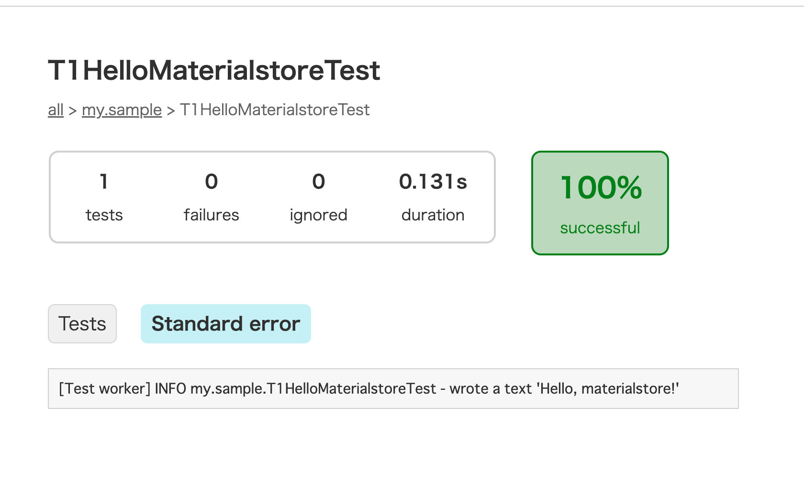
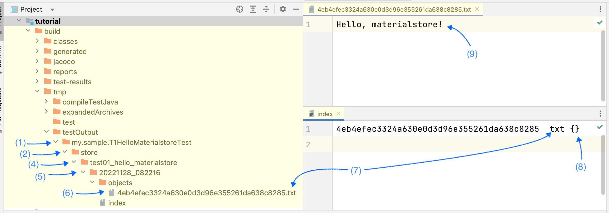
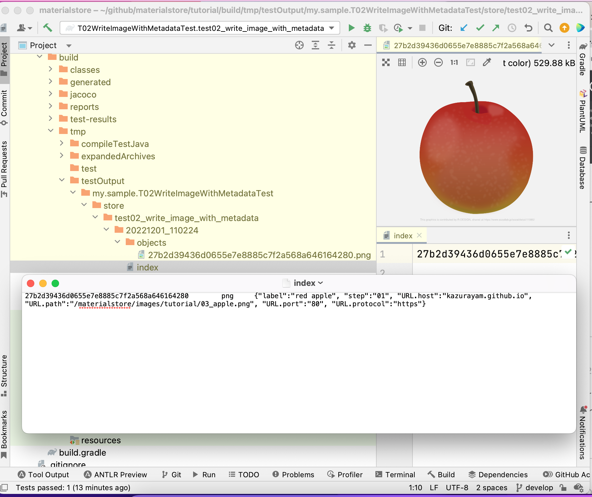

-   <a href="#materialstore-tutorial" id="toc-materialstore-tutorial">Materialstore Tutorial</a>
    -   <a href="#setting-up-a-project" id="toc-setting-up-a-project">Setting up a project</a>
    -   <a href="#1st-example-hello-materialstore" id="toc-1st-example-hello-materialstore">1st example : "Hello, materialstore!"</a>
        -   <a href="#file-tree-created-by-hello-materialstore" id="toc-file-tree-created-by-hello-materialstore">File tree created by "Hello, materialstore"</a>
        -   <a href="#create-a-base-directory" id="toc-create-a-base-directory">Create a base directory</a>
        -   <a href="#create-the-store-directory" id="toc-create-the-store-directory">Create the "store" directory</a>
        -   <a href="#store-class" id="toc-store-class">Store class</a>
        -   <a href="#jobname-class" id="toc-jobname-class">JobName class</a>
        -   <a href="#jobtimestamp-class" id="toc-jobtimestamp-class">JobTimestamp class</a>
        -   <a href="#create-a-file-tree-write-a-material" id="toc-create-a-file-tree-write-a-material">create a file tree, write a "material"</a>
        -   <a href="#file-name-of-the-materials" id="toc-file-name-of-the-materials">File name of the materials</a>
        -   <a href="#filetype" id="toc-filetype">FileType</a>
        -   <a href="#metadata" id="toc-metadata">Metadata</a>
        -   <a href="#types-of-objects-to-write" id="toc-types-of-objects-to-write">Types of objects to write</a>
    -   <a href="#2nd-example-write-an-image-with-metadata" id="toc-2nd-example-write-an-image-with-metadata">2nd example: write an image with Metadata</a>
        -   <a href="#metadata-based-on-url-manually-created-metadata" id="toc-metadata-based-on-url-manually-created-metadata">Metadata based on URL &amp; manually created Metadata</a>
        -   <a href="#order-of-key-value-pairs-in-metadata" id="toc-order-of-key-value-pairs-in-metadata">Order of key-value pairs in Metadata</a>
        -   <a href="#keyvalue-pairs-explicitly-specified" id="toc-keyvalue-pairs-explicitly-specified">key:value pairs explicitly specified</a>
        -   <a href="#retrieving-information-of-a-material" id="toc-retrieving-information-of-a-material">Retrieving information of a material</a>
    -   <a href="#3rd-example-writing-multiple-images" id="toc-3rd-example-writing-multiple-images">3rd example: writing multiple images</a>
    -   <a href="#4th-example-retrieving-a-saved-material" id="toc-4th-example-retrieving-a-saved-material">4th example : retrieving a saved material</a>
    -   <a href="#5th-example-selecting-a-materiallist" id="toc-5th-example-selecting-a-materiallist">5th example : Selecting a MaterialList</a>
    -   <a href="#6th-example-generate-a-html-report-of-a-materiallist" id="toc-6th-example-generate-a-html-report-of-a-materiallist">6th example : generate a HTML report of a MaterialList</a>

-   [API javadoc](https://kazurayam.github.io/materialstore/api/index.html)

-   back to the [repository](https://github.com/kazurayam/materialstore)

# Materialstore Tutorial

Let us begin with a quick introduction to a Java library named "materialstore".

## Setting up a project

Here I assume you have a seasoned programming skill in Java, and you have installed the build tool [Gradle](https://gradle.org/install/). Now let us create a project where you write some Java code for practice.

Let us create a working directory; say `~/tmp/sampleProject`.

    $ cd ~/tmp/
    $ mkdir sampleProject

You want to initialize it as a Gradle project, so you would operate in the console as this:

    $ cd ~/tmp/sampleProject
    $ gradle init

    Select type of project to generate:
      1: basic
      2: application
      3: library
      4: Gradle plugin
    Enter selection (default: basic) [1..4] 1

    Select build script DSL:
      1: Groovy
      2: Kotlin
    Enter selection (default: Groovy) [1..2] 1

    Generate build using new APIs and behavior (some features may change in the next minor release)? (default

    Project name (default: sampleProject):

    > Task :init
    Get more help with your project: Learn more about Gradle by exploring our samples at https://docs.gradle.org/7.4.2/samples

    BUILD SUCCESSFUL in 28s

Then you will find a file `sampleProject/settings.gradle` has been created, which looks like:

**settings.gradle**

    rootProject.name = 'sampleProject'

You will also find a file `sampleProject/build.gradle` file, but it will be empty (comments only). So you want to edit it, like this.

**build.gradle**

    Unresolved directive in adocs/tut1.adoc - include::../build.gradle[lines=1..30]

Please note that you declared the dependency to the `materialstore` library, which is published at the Maven Central repository.

-   <https://mvnrepository.com/artifact/com.kazurayam/materialstore>

You can check if the project is properly setup by executing a command, as follows:

    $ cd ~/tmp/sampleProject/
    $ gradle dependencies --configuration testImplementation

    ------------------------------------------------------------
    Root project 'sampleProject'
    ------------------------------------------------------------

    testImplementation - Implementation only dependencies for source set 'test'. (n)
    +--- com.kazurayam:materialstore:0.12.5 (n)
    +--- org.slf4j:slf4j-api:1.7.25 (n)
    +--- org.slf4j:slf4j-simple:1.7.25 (n)
    \--- org.junit.jupiter:junit-jupiter-api:5.9.0 (n)

    (n) - Not resolved (configuration is not meant to be resolved)

    A web-based, searchable dependency report is available by adding the --scan option.

    BUILD SUCCESSFUL in 1s
    1 actionable task: 1 executed

## 1st example : "Hello, materialstore!"

I have created a JUnit-based Java code that uses the materialstore library: `sampleProject/src/test/java/my/sample/T1HelloMaterialstoreTest.java`, as follows:

**T01HelloMaterialstoreTest.java**

    Unresolved directive in adocs/tut1.adoc - include::../src/test/java/my/sample/T01HelloMaterialstoreTest.java[]

You can run this by running the `test` task of Gradle:

    $ gradle test
    > Task :compileJava NO-SOURCE
    > Task :processResources NO-SOURCE
    > Task :classes UP-TO-DATE
    > Task :compileTestJava
    > Task :processTestResources NO-SOURCE
    > Task :testClasses
    > Task :test

    BUILD SUCCESSFUL in 2s
    2 actionable tasks: 2 executed

The `test` task of Gradle will create a report in HTML format where you can find all output from the test execution. You can find the report at `build/reports/tests/test/index.html`.

    $ cd ~/tmp/sampleProject
    $ tree build/reports/tests/
    build/reports/tests/
    └── test
        ├── classes
        │   └── my.sample.T1HelloMaterialstoreTest.html
        ├── css
        │   ├── base-style.css
        │   └── style.css
        ├── index.html
        ├── js
        │   └── report.js
        └── packages
            └── my.sample.html

    5 directories, 6 files

You want to open the `index.html` in your Web browser to have a look at the test result.

### File tree created by "Hello, materialstore"

The 1st test will create a new file tree as output:

Let us read the Java source of the test `T1HelloMaterialstoreTest` line by line to understand the basic concept and classes of the "materialstore" library. Here I assume that you are a well-trained Java programmer who requires no explanation how to code using JUnit.

### Create a base directory

    import java.nio.file.Path;
    ...
        @BeforeEach
        public void beforeEach() {
            Path dir = createTestClassOutputDir(this);   // (1)

The statement commented as (1) creates a directory `build/tmp/testOutput/<fully qualified test case class name>`. In this directory the test will output everything during its run. The helper method `createTestClassOutputDir(Object)` is defined later in the source file.

### Create the "store" directory

            Path storeDir = dir.resolve("store");   // (2)

The statement (2) declares a `java.nio.file.Path` object named `store` under the working directory `build` which is created at (1).

### Store class

    import com.kazurayam.materialstore.core.filesystem.Store;
    ...

        private Store store;
    ...

            store = Stores.newInstance(storeDir);        // (3)

The statement (3) instantiates an object of `com.kazurayam.materialstore.core.filesystem.Store` class. The directory `store` is actually created by the statement (3).

The `Store` class is the central entry point of the materialstore library. The `Store` class implements methods to write the materials into the file tree. Also the `Store` class implements methods to select (read, retrieve) one or more materials out of the store.

### JobName class

    import com.kazurayam.materialstore.core.filesystem.JobName;
    ...
        @Test
        public void test01_hello_materialstore() throws MaterialstoreException {
            JobName jobName =
                    new JobName("test01_hello_materialstore");       // (4)

The statement (4) declares the name of a sub-directory under the `store` directory. The String value specified for the constructor of `com.kazurayam.materialstore.core.filesystem.JobName` class can be any. It is just a directory name; no deep semantic meaning is enforced.

However, you should remember that some of ASCII characters are prohibited as a part of file/directory names by the underlying OS; therefore you can not use them as the `JobName` object’s value. For example, Windows OS does not allow you to use the following characters:

-   `<` (less than)

-   `>` (greater than)

-   `:` (colon)

-   `"` (double quote)

-   `/` (forward slash)

-   `\` (backslash)

-   `|` (vertical bar or pipe)

-   `?` (question mark)

-   `*` (asterisk)

You can use non-latin characters as JobName. JobName can contain white spaces if necessary. For example, you can write:

        JobName jobName = new JobName("わたしの仕事 means my job");

### JobTimestamp class

    import com.kazurayam.materialstore.core.filesystem.JobTimestamp;
    ...
            JobTimestamp jobTimestamp = JobTimestamp.now();          // (5)

The statement (5) declares the name of a new directory under the `JobName` directory, which will have a name as current timestamp. The name will be in the format of `uuuuMMdd_hhmmss` (year, month, day, hours, minutes, seconds).

The `JobTimestamp` class implements various methods that help you work on. See the [javadoc](https://kazurayam.github.io/materialstore/api/com/kazurayam/materialstore/core/filesystem/JobTimestamp.html) for detail.

### create a file tree, write a "material"

    import com.kazurayam.materialstore.core.filesystem.FileType;
    import com.kazurayam.materialstore.core.filesystem.Material;
    import com.kazurayam.materialstore.core.filesystem.Metadata;
    ...
            String text = "Hello, materialstore!";
            Material material = store.write(jobName, jobTimestamp,   // (6)
                    FileType.TXT,                            // (7)
                    Metadata.NULL_OBJECT,                    // (8)
                    text);                                   // (9)

The lines (6) to (9) creates a file tree under the \`store\`directory, like this:

    $ tree build/tmp/testOutput/my.sample.T1HelloMaterialstoreTest/store/
    build/tmp/testOutput/my.sample.T1HelloMaterialstoreTest/store/
    └── test01_hello_materialstore
        └── 20221128_082216
            ├── index
            └── objects
                └── 4eb4efec3324a630e0d3d96e355261da638c8285.txt

The format of file tree under the `store` directory is specially designed to save the **materials**. The tree format is fixed. You are not supposed to customize it at all. You would delegate all tasks of creating + naming + locating files and directories under the `store` directory to the `Store` object.

As the line commented as (6) tells, a "material" (actually, is a file) is always located under the sub-tree `store/<JobName>/<JobTimestamp>/objects`.

The sub-directory named `objects` will contain one or more files.

### File name of the materials

All files under the `objects` have a fixed format of file name, that is:

**&lt;40 characters in alpha-numeric, calcurated by the SHA1 hash function&gt;.&lt;file extention&gt;**

for example,

`4eb4efec3324a630e0d3d96e355261da638c8285.txt`

Ths `Store#write()` method call produces the leading 40 characters using the [SHA1](https://en.wikipedia.org/wiki/SHA-1) message digest function taking the byte array of the file content as the input. This cryptic 40 characters uniquely identifies the input files regardless which type of the file content: a plain text, CSV, HTML, JSON, XML, PNG image, PDF, zipped archive, MS Excel’s xlsx, etc. This 20 characters is called `ID` of a material.

**You don’t determine the name on the OS file system when you write it into the store. The ID of material is calculated by the `Store` class based on the content.**

### FileType

The line (7) specifies `FileType.TXT`.

                    FileType.TXT,                            // (7)

This gives the file extenstion `txt` to the file. The `com.kazurayam.materialstore.filesystem.FileType` enum declares many concrete FileType instances ready to use. See
<https://kazurayam.github.io/materialstore/api/com/kazurayam/materialstore/core/filesystem/FileType.html> for the complete list. Also you can create your own class that implements `com.kazurayam.materialstore.filesystem.IFileType`. See <https://kazurayam.github.io/materialstore/api/com/kazurayam/materialstore/core/filesystem/IFileType.html>

### Metadata

You can associate various metadata to each materials. A typical metadata of a screenshot of a web page displayed on browser is the URL string (e.g., "https://www.google.com/?q=selenium"). In our first sample code we do not make use of the Metadata at all. So I wrote a placeholder:

                    Metadata.NULL_OBJECT,                (8)

We will cover how to make full use of Metadata later.

### Types of objects to write

The javadoc of the [`Store`](https://kazurayam.github.io/materialstore/api/com/kazurayam/materialstore/core/filesystem/Store.html) shows that it can accept multiple types of object as input to write into the `store`:

-   `java.lang.String`

-   `byte[]`

-   `java.nio.file.Path`

-   `java.io.File`

-   `java.awt.image.BufferedImage`

These types will cover the most cases in your automated UI testing.

## 2nd example: write an image with Metadata

I will show you next sample code `test02_write_image_with_metadata` of `T2MetadataTest` class.

    Unresolved directive in adocs/tut2.adoc - include::../src/test/java/my/sample/T02WriteImageWithMetadataTest.java[lines=21..60]

At the line (10), we create an instance of `java.net.URL` with a String argument "<https://kazurayam.github.io/materialstore/images/tutorial/03_apple.png>". You can click this URL to see the image yourself. You should see an apple.

I create a helper class named `my.sample.SharedMethod` with a method `createURL(String)` that instanciate an instance of `URL`.

**createURL(String)**

    Unresolved directive in adocs/tut2.adoc - include::../src/test/java/my/sample/SharedMethods.java[lines=18..24]

At the statement (11) we get access to the URL. We will effectively download a PNG image file from the URL and obtain a large byte array.
The `downloadURL(URL)` method of `SharedMethods` class implements this processing: converting a URL to an array of bytes.

**downloadUrl(URL)**

    Unresolved directive in adocs/tut2.adoc - include::../src/test/java/my/sample/SharedMethods.java[lines=26..40]

The statement (12) invokes `store.write()` method, which create a new file tree, as this:

### Metadata based on URL & manually created Metadata

the `index` file contains a single line of text, which is something like:

**index**

    27b2d39436d0655e7e8885c7f2a568a646164280 png {"label":"red apple", "step":"01", "URL.host":"kazurayam.github.io", "URL.path":"/materialstore/images/tutorial/03_apple.png", "URL.port":"80", "URL.protocol":"https"}

Please find a JSON-like string enclosed by a pair of curly braces (`{` and `}`). I call this section as **Metadata** of a material. The Metadata contains several **"key":"value"** pairs. The metadata was created as specified by the line (13).

            Metadata.builder(url)           // (13)
                    .put("step", "01")
                    .put("label", "red apple")
                    .build(),

The `url` variable is an instance of `java.net.URL`. You should check the [Javadoc of `URL`](https://docs.oracle.com/javase/7/docs/api/java/net/URL.html). The constructor `new URL(String spec)` can accept a string "<https://kazurayam.github.io/materialstore/images/tutorial/03_apple.png>" and parse it to its components: `protocol`, `host`, `port`, `path`, `query` and `fragment`. The `url` variable passed to the `Metadata.builder(url)` call is parsed by the URL class and transformed into key-value pair `"URL.hostname": "kazurayam.github.io"` and others.

Let me show you a few more examples.

The URL string
`"https://duckduckgo.com/?q=materialstore+kazurayam&atb=v314-1&ia=images"` will make the following Metadata instance:

    {"URL.host":"duckduckgo.com", "URL.path":"/", "URL.port":"80", "URL.protocol":"https", "URL.query":"q=materialstore+kazurayam&atb=v314-1&ia=images"}

The URL string `"https://kazurayam.github.io/materialstore/#first-sample-code-hello-materialstore"` will make the following Metadata instance:

    {"URL.fragment":"first-sample-code-hello-materialstore", URL.host":"kazurayam.github.io", "URL.path":"/", "URL.port":"80", "URL.protocol":"https"}

### Order of key-value pairs in Metadata

In the pair of curly braces (`{` .. `}`), the key-value pairs are arranged by the "key", sorted by the ascending order as string. Therefore, in the above example, the key `URL.fragment` comes first, the key "URL.protocol" comes last.

### key:value pairs explicitly specified

Also the line (13) explicitly created 2 pairs of key:value, that is `"step": "01"` and `"label":"red apple"`.

You can create key:value pairs as many as you want. Both of key and value must be the type String. The key can be any string, the value can be any string as well. You can use any characters including `/` (forward slash), `\` (back slash), `:` (colon). You can use non-ASCII characters. For example: you can create a key-value pair `"番号": "123/456 xyz"`. The Character escaping rule of JSON applies here: a double quote character `"` will be escaped to `\"`; a back-slash character `\` will be escaped to be `\\`.

Metadata is stored in the `index` file, which is apart from the material file itself. The byte array of the image downloaded from a URL is not altered at all. The image is saved into the `objects` directory as is. And then, you can associate a flexible set of Metadata to each individual materials. What sort of Metadata to associate? --- it is completely up to you.

Metadata plays an important role later when you start compiling advanced reports "ChronosDiff" and "TwinsDiff".

### Retrieving information of a material

The line (14) prints the summarized information of the material: the ID, the FileType, and the Metadata.

Also you can get various information out of the `material` variable. For example, the line (15) retrieves the value of `"URL.host"` out of the material object, compares it with the expected staring value.

            assertEquals("kazurayam.github.io",
                    material.getMetadata().get("URL.host"));        // (15)

Please check the [Javadoc of Material](https://kazurayam.github.io/materialstore/api/com/kazurayam/materialstore/core/filesystem/Material.html) for what sort of accessor methods are implemented.

## 3rd example: writing multiple images

Web will make a test case which downloads 3 image files from public URL and store them into the store.

    Unresolved directive in adocs/tut3.adoc - include::../src/test/java/my/sample/T03WriteMultipleImagesTest.java[lines=18..40]

This code calls `SharedMethods.write3images(Store, JobName, JobTimestap)` method. It is implemented as this:

**SharedMethod.write3images**

    Unresolved directive in adocs/tut3.adoc - include::../src/test/java/my/sample/SharedMethods.java[lines=43..74]

This code makes HTTP requests to

-   <http://kazurayam.github.io/materialstore/images/tutorial/03_apple.png>

-   <http://kazurayam.github.io/materialstore/images/tutorial/04_mikan.png>

-   <http://kazurayam.github.io/materialstore/images/tutorial/05_money.png>

and save the image files into a directory inside the store. When you run this test case, you will get a new file tree as follows.

The `index` file will contain 3 lines, one for each PNG image file.

**index**

    8a997bec64cd056c2075da95c0c281320ee7a7c1 png {"label":"mikan", "step":"02", "URL.host":"kazurayam.github.io", "URL.path":"/materialstore/images/tutorial/04_mikan.png", "URL.port":"80", "URL.protocol":"https"}
    36f9f62bdb3ad45cb8c6bc1f4062fbbd4fd180db    png {"label":"money", "step":"03", "URL.host":"kazurayam.github.io", "URL.path":"/materialstore/images/tutorial/05_money.png", "URL.port":"80", "URL.protocol":"https"}
    27b2d39436d0655e7e8885c7f2a568a646164280    png {"label":"red apple", "step":"01", "URL.host":"kazurayam.github.io", "URL.path":"/materialstore/images/tutorial/03_apple.png", "URL.port":"80", "URL.protocol":"https"}

## 4th example : retrieving a saved material

    Unresolved directive in adocs/tut4.adoc - include::../src/test/java/my/sample/T04SelectASingleMaterialWithQueryTest.java[lines=18..40]

## 5th example : Selecting a MaterialList

    Unresolved directive in adocs/tut5.adoc - include::../src/test/java/my/sample/T05SelectMaterialListTest.java[]

## 6th example : generate a HTML report of a MaterialList

    Unresolved directive in adocs/tut6.adoc - include::../src/test/java/my/sample/T06MaterialListReportTest.java[lines=20..60]
